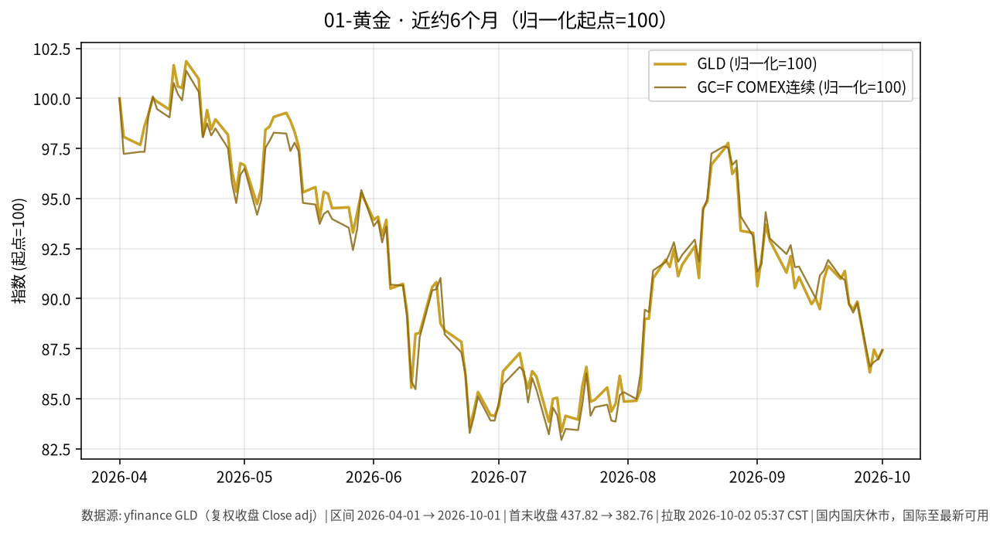

# 01-黄金日报 · 2026-10-02

> **市场日历**：**国庆休市第 2 天**（A 股 / 国内贵金属相关交易所口径休市约 **2026-10-01 至 2026-10-07**，预计 **2026-10-08** 恢复）。本草稿撰写约 **05:35–05:40 CST**，国内无 10/2 成交。**国内上一交易日仍为 2026-09-30（周三，节前最后交易日）**。国际现货/COMEX/美股 ETF 已更新至**美东 2026-10-01（周四）**收盘或当日公开媒体点位；相对国内市场呈“外盘可交易、内盘冻结”。

## 市场状态

- **美东 10/1 金价收涨**：偏软通胀数据压低 10 月加息即时概率，现货与期货同步回升约 **0.5%–0.6%**；但盘中美债收益率一度刷新二十余年高位、美元走强，限制上行空间（Reuters / Kitco）。
- ETF 端：GLD 收 **382.76**，较 9/30 的 380.84 **+0.50%**；COMEX 连续（GC=F）收 **4,207.80**，较 9/30 的 4,186.70 **+0.50%**。
- 美元与美债：**DXY 收约 102.00**（较 9/30 的 101.45 **+0.55%**，站上 102）；10Y（^TNX）收约 **5.237%**，较 9/30 的 5.293% **回落约 5.6 bp**——盘中曾冲高至约 **5.34%** 一带后回吐（Dow Jones / Reuters 盘中高点口径）。
- 白银（SI=F）收 **61.35**，较 9/30 **+2.08%**，弹性大于黄金。

## 关键数据

| 指标 | 数值 | 日变化 | 备注 | 数据时点 |
| --- | --- | --- | --- | --- |
| 现货黄金（Reuters 盘中） | 约 **4,183.22** 美元/盎司 | 约 **+0.6%** | 约 11:51 GMT 报道点位 | Reuters via Kitco，美东 **2026-10-01** |
| 现货黄金（CNBC Select 早盘） | 约 **4,180.59** 美元/盎司 | 相对 9/30 同点约 4,207.81 偏低 | 9:00 a.m. ET 报道点位，非官方结算 | CNBC Select，美东 10/1 |
| 美黄金期货 12 月（Reuters） | 约 **4,212.80** | 约 **+0.6%** | 盘中报道 | Reuters，10/1 |
| COMEX 连续（yfinance GC=F） | **4,207.80** | 较 9/30 **+0.50%** | 连续合约，与特定交割月点差并存 | yfinance，**2026-10-01** |
| SPDR 黄金 ETF（GLD） | **382.76** | 较 9/30 的 380.84 **+0.50%** | ETF 与现货/期货点差并存 | yfinance，美东 10/1 |
| COMEX 白银（SI=F） | **61.35** | 较 9/30 的 60.098 **+2.08%** | Reuters 盘中现货银另报约 61.11（+1.2%） | yfinance / Reuters |
| 美元指数 DXY（DX-Y.NYB） | **102.003** | 较 9/30 的 101.450 **+0.55%** | 站上 102 | yfinance，10/1 |
| 美债 10Y（^TNX） | **5.237%** | 较 9/30 的 5.293% **−5.6 bp** | DJ/Tradeweb 3pm ET 口径约 **5.233%**（−5.9 bp）；盘中高点约 5.34% | yfinance / Morningstar-DJ，10/1 |
| 国内 Au9999 | **未能获取 10/1–10/2 新报价** | — | 国内休市；节前 9/30 媒体约 907 元/克仅作历史参照 | — |

*说明：现货为公开媒体盘中/早盘点位；GC=F、特定交割月、GLD 与媒体现货存在点差与合约差异，并存标注。国内休市期间无新成交。*

### 近约 6 个月轨迹（图）

- 图见上文：GLD 与 GC=F 归一化（起点=100），区间约 **2026-04-01 → 2026-10-01**（yfinance 复权收盘）。
- GLD 同期约 **437.82 → 382.76**（约 **−12.6%**），反映近月利率重定价背景下的阶段性回撤。

## 简要解读

1. 10/1 金价出现**“数据支撑 vs 美元/利率压制”并存**：偏软通胀报道降低 10 月加息即时概率（公开 FedWatch 口径约降至三成多），推动现货/期货/GLD 同步收涨约半个点。
2. 美债 10Y **收盘回落约 5–6 bp**，但盘中曾冲至约 **5.34%**（二十余年高位附近）后回吐，说明利率波动仍大；机会成本约束并未解除，只是当日边际缓和。
3. DXY 收于 **102** 上方，对非美买家仍构成汇率端压制；金价涨幅被美元走强部分对冲。
4. 9 月公开媒体描述金价月度回撤约 **6%+**；10/1 反弹属数据脉冲后的修复，幅度有限。
5. **国内休市 vs 国际可交易**：节后 10/8 开盘时，国际金价路径可能反映为国内相关品种开盘缺口；本报告不对跳空方向作预测。

## 关注点/风险

- **利率路径**：10Y 若再度逼近/突破 5.3%，黄金机会成本约束会快速回归。
- **美元与能源**：DXY 站上 102、油价高位均可压制金价或抬升通胀溢价。
- **数据日历**：美东关注非农等就业数据与 Fed 官员表态（公开日程以官方为准）。
- **源口径差异**：现货盘中、COMEX 交割月/连续、GLD 点差显著。
- **节假日**：国内休市期间无法同步交易国内金；国际波动在 10/8 前后或反映为开盘缺口。
- **不构成操作指引**：本文只陈述价格与机制，不含买卖或杠杆建议。

## 来源与时间

- yfinance：GC=F、SI=F、GLD、DX-Y.NYB、^TNX（拉取约 **2026-10-02 05:38 CST**）
- Reuters via Kitco：现货约 4,183.22（约 11:51 GMT）；12 月期货约 4,212.80（2026-10-01）
- CNBC Select：现货约 4,180.59（美东 10/1 09:00）
- Morningstar / Dow Jones：10Y 约 5.233%（3 p.m. ET，2026-10-01）
- 图表：`charts/01-黄金-6m.png`（yfinance，约 2026-04-01→2026-10-01）
- **本草稿仅为信息整理，不构成投资建议。未 push GitHub。**
