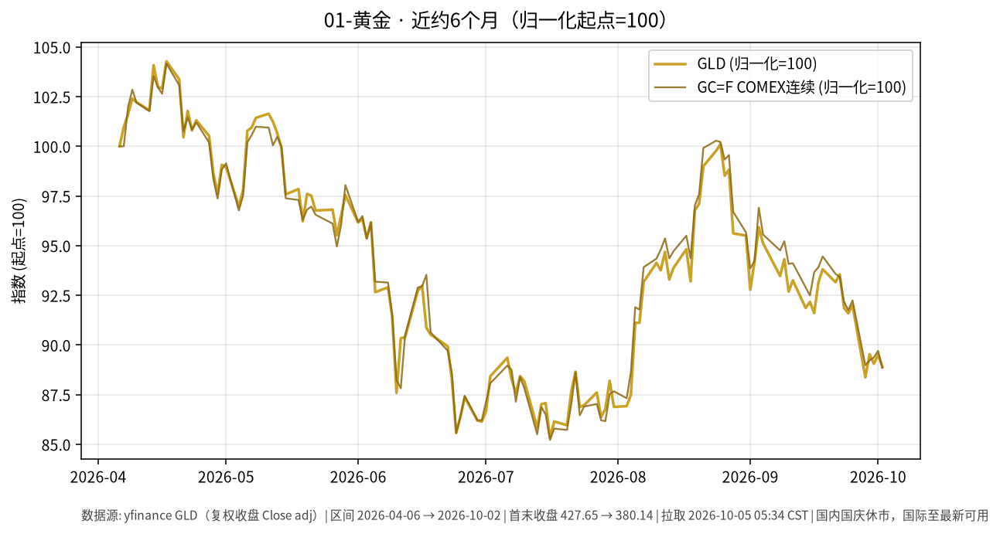

# 01-黄金日报 · 2026-10-05（周一）

> **市场日历**：国庆休市第 5 天（A 股及国内贵金属相关交易所约 2026-10-01 至 10-07 休市，预计 **10-08** 恢复，以交易所公告为准）。国内上一交易日仍为 **2026-09-30**。国际市场最新收盘为**美东 2026-10-02（周五）**；周末无新成交。撰写约 05:35 CST。

## 市场状态

- 美东 10/2 公布 9 月非农：新增 **2.9 万**（预期约 9 万），失业率 **4.2%**，8 月下修至 13.3 万（Reuters）。
- 数据公布后金价先冲高约 1%（期货盘中约 4,248），随后美债收益率、美元反向走强，金价收跌：现货约 **4,132–4,147**（约 −0.75% 至 −1.1%，不同报道时点），本周约 **−3.2%**（Reuters / Invezz 转述）。
- yfinance 口径：GLD 收 **380.14（−0.68%）**，GC=F 连续收 **4,162.30（−0.95%）**；GLD 本周约 **−3.4%**。

## 关键数据

| 指标 | 数值 | 日变化 | 数据时点 / 来源 |
| --- | --- | --- | --- |
| GLD | 380.14 | 较 10/1 的 382.76 −0.68% | 美东 10/2，yfinance |
| COMEX 连续 GC=F | 4,162.30 | 较 10/1 的 4,202.30 −0.95% | 美东 10/2，yfinance |
| 美金期货结算（Reuters 口径） | 约 4,177.50 | 约 −0.59% | 10/2，Invezz 转述 Reuters |
| 现货黄金 | 约 4,132.65–4,146.54 | 约 −1.08% / −0.75% | 10/2 不同时点，Kitco(Reuters) / Invezz |
| 白银 SI=F | 60.415 | −0.51% | 10/2，yfinance |
| 美元指数 DXY | 101.93 | −0.17%（本周约 +0.95%） | 10/2，yfinance |
| 美 10Y（^TNX） | 5.277% | +4.0 bp | 10/2，yfinance；Reuters 盘中低点约 5.157% |
| 国内 Au9999 | 无新报价 | — | 国内休市 |

**近 6 个月**：GLD 约 427.65（2026-04-06）→ 380.14（2026-10-02），约 **−11.1%**；GC=F 约 −11.2%。

## 简要解读

1. 弱就业本来压低了 10 月加息概率（Reuters/LSEG 口径约从 26% 降到 21%），金价短暂受益。
2. 但长端美债收益率随后反转上行，10Y 收在 5.2% 以上、本周第五周上涨，持有黄金的机会成本没有下降，金价把涨幅吐回还收跌。
3. 当前黄金的主导变量仍是美债实际收益率和美元，而不是单一经济数据。
4. 国内休市，节后 10/8 开盘时，国内金价可能对假期外盘变化做一次集中反映；方向本文不作判断。

## 关注点与风险

- 美 10Y 若继续停在 5.2%–5.3% 一带，黄金的利率压制仍在。
- 美联储 10 月会议预期、后续通胀数据、美元走势。
- 现货、期货不同合约、GLD 之间存在点差，引用时注意口径。
- 本文只描述价格与机制，不构成买卖或加仓建议。

## 来源与时间

- yfinance：GLD、GC=F、SI=F、DX-Y.NYB、^TNX（拉取约 2026-10-05 05:34 CST）
- Reuters（经 Kitco、WTBX 转载）、WSJ、Invezz：2026-10-02 非农与金价、美债报道
- 图：`charts/2026-10-05-6m.png`，yfinance 复权收盘，2026-04-06 → 2026-10-02，归一化起点=100
