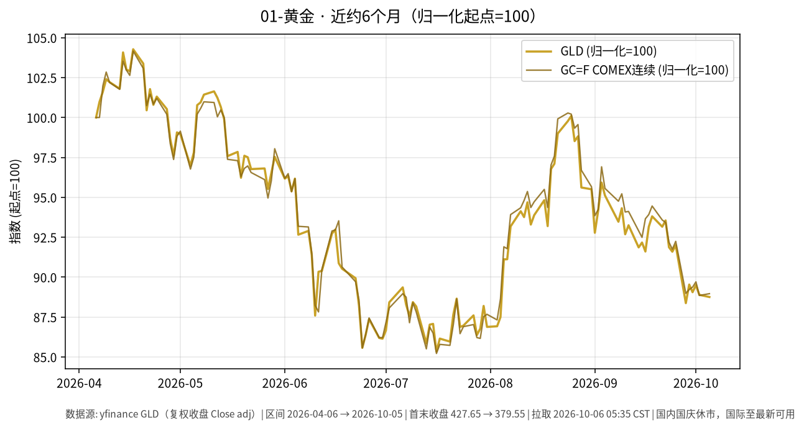

# 01-黄金日报 · 2026-10-06（周二）

> **市场日历**：国庆休市第 6 天（A 股及国内贵金属相关交易所约 2026-10-01 至 10-07 休市，预计 **10-08** 恢复，以交易所公告为准）。国内上一交易日仍为 **2026-09-30**。国际市场最新收盘为**美东 2026-10-05（周一）**。撰写约 05:40 CST。

## 市场状态

- 周一金价窄幅震荡、略偏弱：现货盘中约 **4,132–4,156**（FXStreet / CNBC / Fortune 不同时点），BullionVault 称伦敦午间较周五定盘价约 −0.9%。
- 市场对 10 月加息的押注明显回落（CME FedWatch 口径加息概率约 20%，一周前约 70%），但 12 月前至少加息一次的概率仍在 80% 以上。
- 压制金价的两个因素都还在：美 10Y 收在 **5.31%**（2002 年以来最高，Dow Jones / Tradeweb），美元指数升到 **102.12**（欧元跌至 17 个月低位）。
- CFTC 数据显示基金经理在 COMEX 黄金上的净多头已连续 5 周减少（BullionVault）。
- yfinance 口径：GLD 收 **379.55（−0.16%）**，GC=F 连续收 **4,167.6（+0.13%）**；白银 SI=F **61.40（+2.4%）** 表现更强。

## 关键数据

| 指标 | 数值 | 日变化 | 数据时点 / 来源 |
| --- | --- | --- | --- |
| GLD | 379.55 | 较 10/2 的 380.14 −0.16% | 美东 10/5，yfinance |
| COMEX 连续 GC=F | 4,167.6 | 较 10/2 的 4,162.3 +0.13% | 美东 10/5，yfinance |
| 现货黄金 | 约 4,132–4,156 | 盘中约 −0.3% 至平 | 10/5 不同时点，FXStreet / CNBC / Fortune |
| 白银 SI=F | 61.40 | +2.37% | 10/5，yfinance |
| 美元指数 DXY | 102.12 | +0.19% | 10/5，yfinance |
| 美 10Y（^TNX） | 5.311% | +3.4 bp | 10/5，yfinance；Dow Jones 收盘口径 5.310% |
| 国内 Au9999 | 无新报价 | — | 国内休市 |

**近 6 个月**：GLD 约 427.65（2026-04-06）→ 379.55（2026-10-05），约 **−11.2%**；GC=F 约 4,684.7 → 4,167.6，约 **−11.0%**。金价已连续 6 周周线下跌，上周触及 8 月 5 日以来低点（BullionVault）。

## 简要解读

1. 加息预期在降温，本来对黄金有利；但长端美债收益率和美元同时走高，持有黄金的机会成本没有下降，所以金价只是止跌、没有反弹。
2. 9 月 ISM 服务业价格指数升到 74.0（2022 年 7 月以来最高），通胀压力仍在，这让“利率维持高位更久”的预期站得住。
3. 欧洲方面（法国财政、西班牙提前大选）推高了美元，这对以美元计价的金价是额外压力。
4. 国内节后 10/8 开盘时，国内金价可能对整个假期的外盘变化做一次集中反映；方向本文不作判断。

## 关注点与风险

- 本周三（美东 10/7）美联储 9 月会议纪要，以及 10 年、30 年期美债拍卖结果。
- 美 10Y 能否站稳 5.3% 上方；美元指数是否继续走强。
- 现货、期货不同合约、GLD 之间存在点差，引用时注意口径。
- 本文只描述价格与机制，不构成买卖或加仓建议。

## 来源与时间

- yfinance：GLD、GC=F、SI=F、DX-Y.NYB、^TNX（拉取约 2026-10-06 05:35 CST）
- FXStreet、BullionVault、CNBC、Fortune：2026-10-05 金价报道；Dow Jones（Morningstar 转载）：10Y 收盘；ISM 9 月服务业报告（PR Newswire）
- 图：`charts/2026-10-06-6m.png`，yfinance 复权收盘 GLD + GC=F，2026-04-06 → 2026-10-05，归一化起点=100
