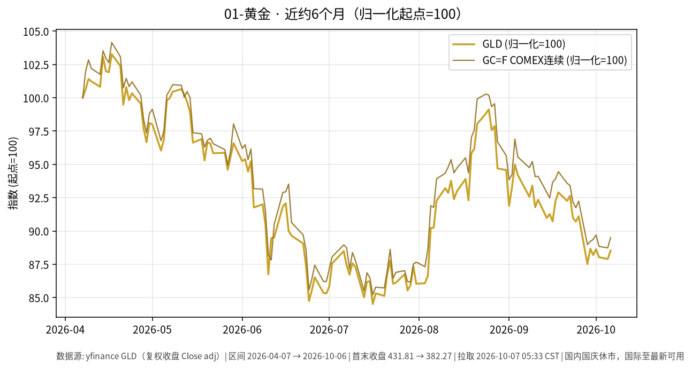

# 01-黄金日报 · 2026-10-07（周三）

> **市场日历**：国庆休市第 7 天（最后一天）（A 股及国内贵金属相关交易所约 2026-10-01 至 10-07 休市，预计 **10-08** 恢复，以交易所公告为准）。国内上一交易日仍为 **2026-09-30**。国际市场最新收盘为**美东 2026-10-06（周二）**。撰写约 05:45 CST。

## 市场状态

- 周二金价反弹：COMEX 10 月主力合约结算 **4,159.20**（+30.80，**+0.75%**），为 9 月 16 日以来最大单日涨幅，结束两连跌（Dow Jones Market Data）；现货盘中约 **4,164–4,177**（USA TODAY 08:05 ET 4,176.74 / CNBC 09:00 ET 4,169.68 / Alex Lexington 13:59 ET 4,163.80，+0.62%）。
- 前一天压制金价的两个因素同时松动：美 10Y 从 5.31% 回落到 **5.27%**（−4 bp，Tradeweb 15:00 ET 口径），美元指数从 18 个月高位回落到约 **101.86**（FXStreet / yfinance）。
- yfinance 口径：GLD 收 **382.27（+0.72%）**，GC=F 连续收 **4,192.7（+0.86%）**；白银 SI=F **61.70（+1.37%）**。
- 注意：yfinance 把 GC=F 的 10/5 收盘修订为 4,156.8（昨日日报引用时为 4,167.6），本文日变化按修订后数值计算。

## 关键数据

| 指标 | 数值 | 日变化 | 数据时点 / 来源 |
| --- | --- | --- | --- |
| GLD | 382.27 | 较 10/5 的 379.55 +0.72% | 美东 10/6，yfinance |
| COMEX 连续 GC=F | 4,192.7 | 较 10/5 的 4,156.8 +0.86% | 美东 10/6，yfinance |
| COMEX 10 月合约结算 | 4,159.20 | +30.80（+0.75%） | 10/6 结算，Dow Jones（Morningstar 转载） |
| 现货黄金 | 约 4,164–4,177 | 盘中约 +0.4% 至 +0.7% | 10/6 不同时点，USA TODAY / CNBC / Alex Lexington |
| 白银 SI=F | 61.70 | +1.37% | 10/6，yfinance |
| 美元指数 DXY | 101.86 | −0.30% | 10/6，yfinance；FXStreet 盘中约 101.85 |
| 美 10Y（^TNX） | 5.269% | −4.2 bp | 10/6，yfinance；Tradeweb 收盘口径 5.270% |
| 国内 Au9999 | 无新报价 | — | 国内休市 |

**近 6 个月**：GLD 约 431.81（2026-04-07）→ 382.27（2026-10-06），约 **−11.5%**；GC=F 约 4,684.7 → 4,192.7，约 **−10.5%**。区间低点在 7 月 16 日（GLD 约 364.96）；COMEX 主力合约仍较 1 月 29 日的历史高点 5,318.40 低约 21.8%，年初至今约 −3.9%（Dow Jones）。

## 简要解读

1. 周二是“利率和美元同时回落”的一天：10Y 回落 4 bp、美元指数回落约 0.3%，持有黄金的机会成本略降，金价随之反弹约 0.7%–0.9%。
2. 欧洲方面压力缓和（法德 10 年利差从 1.5 个百分点以上收窄到约 1.3，欧元从 17 个月低位反弹），这是美元回落的主要原因之一（FXStreet）。
3. 政策面没有新变化：美联储 9 月 16 日已加息 25 bp 至 3.75%–4.00%；市场对 10 月 28 日会议维持不变的定价约 78%（CME FedWatch，CNBC 引述）。旧金山联储 Daly 表示是否继续加息取决于通胀冲击是消退还是叠加。
4. 国内节后 10/8 开盘，国内金价可能对整个假期外盘变化（含 10/5 的下跌与 10/6 的反弹）做集中反映；方向本文不作判断。

## 关注点与风险

- 美东 10/7（周三）：13:00 ET 10 年期美债拍卖（约 390 亿美元，北京时间 10/8 01:00 左右出结果），14:00 ET 美联储 9 月会议纪要（北京时间 10/8 02:00）；两者均在本文撰写时尚未公布。
- 美 10Y 能否重新站上 5.3%、美元指数能否回到 102 上方；周二的回落只是一天，前一天刚创阶段新高。
- 现货、期货不同合约、GLD 之间存在点差（如 10 月合约结算 4,159.20 与 GC=F 连续 4,192.7 口径不同），引用时注意口径。
- 本文只描述价格与机制，不构成买卖或加仓建议。

## 来源与时间

- yfinance：GLD、GC=F、SI=F、DX-Y.NYB、^TNX（拉取约 2026-10-07 05:33 CST）
- Dow Jones Market Data（Morningstar 转载）：COMEX 金结算、10Y 收盘；USA TODAY、CNBC、Alex Lexington：10/6 现货金价；FXStreet：美元指数与欧元；CNBC：FedWatch 概率；美联储 9/16 声明；Daly 讲话（10/6 媒体报道）
- 图：`charts/2026-10-07-6m.png`，yfinance 复权收盘 GLD + GC=F，2026-04-07 → 2026-10-06，归一化起点=100
