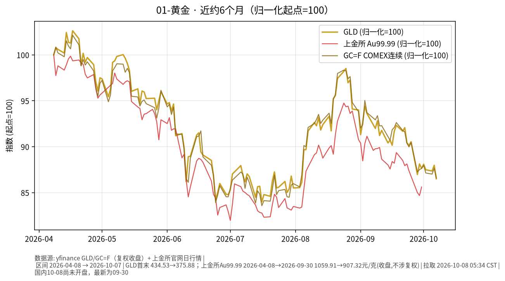

# 01-黄金日报 · 2026-10-08（周四）

> **市场日历**：今天是国庆节后首个交易日——上交所公告 10-01 至 10-07 休市、**10-08（周四）起照常开市**。撰写时约 05:35 CST，国内尚未开盘，国内黄金最新收盘仍是 **2026-09-30**。国际市场最新收盘为**美东 2026-10-07（周三）**。

## 市场状态

- 周三金价回落：COMEX 前月（10 月）合约结算 **4,113.80**（−45.40，**−1.09%**），为 8 月 4 日以来最低结算价，近 4 个交易日 3 天下跌（Dow Jones Market Data）。现货盘中跌约 1.3% 至 **4,107.88**（美东 11:43，北京时间 10/7 23:43），触及 8 月 5 日以来低点（Reuters / Kitco）。
- 当天压制金价的两个因素：美元指数回升约 0.4%–0.5%（yfinance 收 **102.28**，为近 6 个月区间内最高收盘），美 10Y 盘中一度升至约 5.35%（2002 年以来最高），收盘 **5.276%**（+0.6 bp，Tradeweb）。
- 美联储 9 月会议纪要（北京时间 10/8 02:00 公布）：多数与会者认为年底前再加息一次“可能合适”；CME FedWatch 显示 10 月加息概率约 19.4%，12 月约 83%（Reuters）。
- yfinance 口径：GLD 收 **375.88（−1.67%）**，GC=F 连续收 **4,136.7（−1.20%）**；白银 SI=F **60.05（−1.83%）**。
- 国内：上金所 Au99.99 停在 9/30 收盘 **907.32 元/克**（+1.09%），上期所黄金连续 AU0 9/30 收 **910.58**（新浪）。
- 前值修订：yfinance 把 GC=F 10/6 收盘从昨日日报引用的 4,192.7 修订为 **4,187.1**（与 12 月合约结算一致），SI=F 10/6 从 61.70 修订为 61.168，美元指数 10/6 从 101.859 修订为 101.830；本文日变化按修订后数值计算。

## 关键数据

| 指标 | 数值 | 日变化 | 数据时点 / 来源 |
| --- | --- | --- | --- |
| GLD | 375.88 | 较 10/6 的 382.27 −1.67% | 美东 10/7，yfinance |
| COMEX 连续 GC=F | 4,136.7 | 较 10/6（修订）4,187.1 −1.20% | 美东 10/7，yfinance |
| COMEX 10 月合约结算 | 4,113.80 | −45.40（−1.09%） | 10/7 13:49 ET（北京 10/8 01:49），Dow Jones（Morningstar 转载） |
| 现货黄金 | 约 4,107.88 | 盘中约 −1.3% | 10/7 11:43 EDT（北京 10/7 23:43），Reuters / Kitco |
| 白银 SI=F | 60.05 | −1.83% | 美东 10/7，yfinance |
| 美元指数 DXY | 102.28 | +0.44% | 美东 10/7，yfinance；Reuters 盘中 102.24 |
| 美 10Y | 5.276% | +0.6 bp | 10/7 15:00 ET（北京 10/8 03:00），Tradeweb；yfinance ^TNX 5.277% |
| 上金所 Au99.99 | 907.32 元/克 | +1.09% | 2026-09-30，上金所官网日行情 |
| 上期所 AU0 | 910.58 | — | 2026-09-30，新浪期货日 K |

**国庆假期外盘累计（9/30 → 10/7 收盘，yfinance）**：GLD 380.84 → 375.88，约 **−1.3%**；GC=F 4,186.7 → 4,136.7，约 **−1.2%**；美元指数 101.45 → 102.28，约 **+0.8%**。

**近 6 个月**：GLD 434.53（2026-04-08）→ 375.88（2026-10-07），约 **−13.5%**；GC=F 4,777.2 → 4,136.7，约 **−13.4%**；上金所 Au99.99 1,059.91 → 907.32 元/克（至 9/30），约 **−14.4%**。区间低点：GLD 7 月 16 日约 364.96、Au99.99 7 月 1 日 868.80。COMEX 前月合约较 1 月 29 日历史高点 5,318.40 低约 22.65%，年初至今约 −4.9%（Dow Jones）。

## 简要解读

1. 周三与周二方向相反：周二是“利率、美元同时回落”，周三是“美元走强 + 长端利率盘中创 24 年新高”，金价随之回吐并跌至两个月低位。
2. 美元走强的直接原因之一是欧元下跌（法国 10Y 收益率单日 +11.9 bp 至约 4.87%，欧元约 −0.5% 至 1.1198）；另外油价高企（布伦特约 101 美元）也被市场视为支撑美元的因素（Reuters / Invezz）。
3. 纪要内容与市场之前的定价大体一致（“年底前可能再加息一次”），公布后美元维持涨幅；10Y 则在强劲的 10 年期拍卖后从盘中高位回落，收盘基本走平。
4. 国内今天复市，Au99.99 等国内金价将首次对整个假期的外盘变化（以美元计约 −1.2%）做反映；实际开盘幅度还受人民币汇率、国内溢价等因素影响，本文不作方向判断。

## 关注点与风险

- 国内节后首日：国内金价与国际金价之间的价差变化；上金所、上期所开盘后的成交情况。
- 美东 10/8（周四）13:00 ET 30 年期美债拍卖（约 220 亿美元，北京时间 10/9 01:00）；美国 9 月 CPI 于美东 10/14 08:30 公布（北京时间 10/14 20:30）。
- 美元指数已在近 6 个月区间高位，欧洲财政压力（法国、西班牙提前大选）是美元方向的一个外部变量。
- 现货、期货不同合约、GLD 之间存在点差（如 10 月合约结算 4,113.80 与 GC=F 连续 4,136.7 口径不同），引用时注意口径。
- 本文只描述价格与机制，不构成买卖或加仓建议。

## 来源与时间

- yfinance：GLD、GC=F、SI=F、DX-Y.NYB、^TNX（拉取 2026-10-08 05:34 CST）
- 上海黄金交易所官网日行情（Au99.99，拉取 2026-10-08 05:34 CST）；新浪期货 AU0 日 K
- Dow Jones Market Data（Morningstar 转载）：COMEX 金结算、10Y 收盘；Reuters（Kitco、Global Banking & Finance 转载）：现货金、美元与欧元、FedWatch；美联储官网：9 月会议纪要（10/7 发布）；上证公告〔2026〕22 号：休市安排
- 图：`charts/2026-10-08-6m.png`，yfinance 复权收盘 GLD + GC=F（2026-04-08 → 2026-10-07）叠加上金所 Au99.99 收盘（2026-04-08 → 2026-09-30，不涉复权），归一化起点=100
