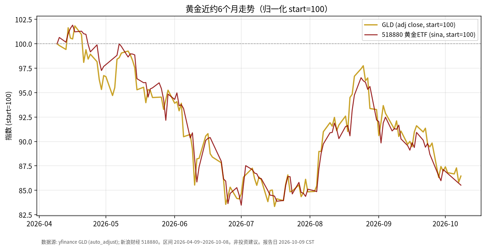

# 黄金日报 · 2026-10-09

> 日历说明：报告日为 **2026-10-09（周五，Asia/Shanghai）清晨**。A股国庆休市为 10/1–10/7，**10/8 起照常开市**；本报告撰写时（约 06:30 CST）A股当日尚未开盘，**国内相关收盘价取 2026-10-08**。美股/GLD 取 **2026-10-08** 收盘。

## 1. 市场状态

- 海外现货金价在 10/8 自周中回落后反弹：公开报道现货约 **4140 美元/盎司**量级（约 +0.9%～1.0% 当日），伴随美债收益率与美元指数自高位回落。
- ETF 口径： **GLD** 10/8 收盘 **378.62**，较前一交易日 **375.88** 上涨约 **+0.73%**。
- 在岸代理：华安黄金 ETF **518880** 10/8 收盘 **8.474**，较节前最后交易日 9/30 的 **8.633** 约 **-1.84%**（节后首日承接海外波动）。
- 宏观背景（公开报道）：美债 10 年期收益率近期触及约 **5.35%** 一带（2002 年以来高位附近），10/8 回落至约 **5.23%～5.27%**；美元指数曾上探约 **102.5** 后回落。高实际利率与强美元仍是压制无息黄金的主要描述性因素。

## 2. 关键数据

| 标的 | 最新交易日 | 收盘 | 日变动 | 近约1个月 | 近约6个月（自2026-04-09） |
|------|------------|------|--------|-----------|---------------------------|
| GLD（yfinance, auto_adjust） | 2026-10-08 | 378.62 | +0.73% | 约 -4.5% | 约 **-13.5%** |
| 518880 黄金ETF（新浪日K close） | 2026-10-08 | 8.474 | -1.84%（相对9/30） | 约 -4.8% | 约 **-14.5%** |
| 美债10Y ^TNX（yfinance） | 2026-10-08 | **5.231%** | 约 -4.6 bp（相对10/7） | 水平抬升 | 自约4.29%升至5.23% |

图表为 GLD 与 518880 归一化至 start=100 的可比走势（见上图）。

## 3. 简要解读

- 近半年黄金 ETF 价格自 4 月高位回撤明显：GLD 与在岸 518880 轨迹高度同步，反映**利率/美元主导**的定价环境。
- 10/8 当日海外金价与 GLD 随收益率回落而反弹，但月度与半年维度仍处回撤区间；在岸 ETF 节后首日仍录得下跌，存在时差与汇率、溢价折价等因素，不宜与美元现货一一对应。
- 本文只描述价格与利率如何共同变化，不评价是否应增减仓。

## 4. 关注点与风险

- **美债实际利率与美元**：若收益率再度逼近近期高点，对黄金的机会成本压力可能再现。
- **政策预期**：FOMC 纪要与官员表态影响“更高更久”定价，属于路径不确定项。
- **在岸/离岸价差**：518880 与 GLD/现货可能因汇率、交易时段、折溢价出现短期偏离。
- **数据局限**：国内金价另有上金所等口径，本报告以 ETF 公开行情为主。

## 5. 来源与时间

- 行情：yfinance（GLD、^TNX）；新浪财经日K（518880）——拉取时间约 **2026-10-09 06:30 CST**。
- 现货与宏观叙述：USAGOLD 日报 2026-10-08；FXStreet / Investing 等关于 10/8 金价与美债收益率的公开报道。
- A股休市安排：上交所 2026 年休市安排（国庆 10/1–10/7 休市，10/8 起开市）。
- 声明：事实梳理，**非投资建议**。
