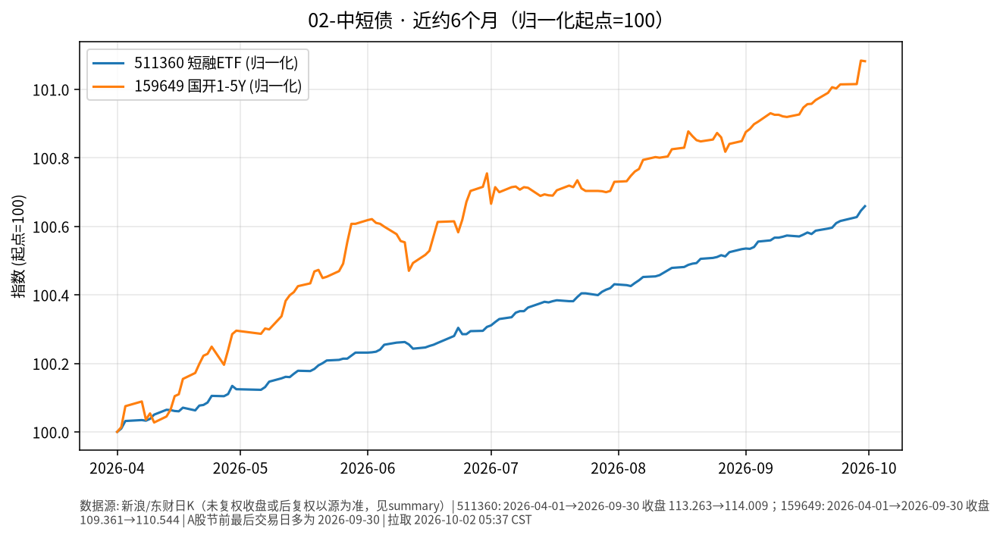

# 02-中短债日报 · 2026-10-02

> **市场日历**：**国庆休市第 2 天**（银行间/交易所债市随国内假期休市，约 **2026-10-01 至 2026-10-07**，预计 **2026-10-08** 恢复）。撰写约 **05:35–05:40 CST**，无 10/2 成交。下文国内关键数据均为**上一交易日 2026-09-30（周三，节前最后交易日）**收盘或当日资金利率；美国短端对照更新至美东 **2026-10-01**。

## 市场状态

- **国内债市/资金面冻结**：10/1–10/2 无新成交、无新 Shibor/公开市场操作可报；节前最后交易日（9/30）资金面公开描述为**均衡偏松**，短融 / 国开 1–5Y 代理 ETF **几乎持平**。
- **美短端 10/1**：13 周国债贴现率（^IRX）收 **3.982%**，较 9/30 的 4.030% **−4.8 bp**；与美债长端当日回落同向，但仍远高于国内中短端。
- 中美短端利差悬殊格局未变；国内中短债定价主轴仍是**国内流动性与供给**，节后开市前无增量信息。

## 关键数据

| 指标 | 数值 | 日变化/备注 | 近况 | 数据时点 |
| --- | --- | --- | --- | --- |
| Shibor 隔夜 | **1.362%** | 上行 **1.69 bp**（相对 9/29） | 节前最后交易日；**10/1–10/2 无新公布** | 新华财经，**2026-09-30** |
| Shibor 7 天 | **1.371%** | 下行 **1.2 bp** | 低于隔夜 | 同上 |
| Shibor 14 天 | **1.398%** | 上行 **1.41 bp** | 跨节期限略贵 | 同上 |
| Shibor 1 个月 | **1.421%** | 下行 **0.27 bp** | 短端中枢仍低 | 同上 |
| 央行公开市场（9/30） | 隔夜逆回购 **8,335** 亿；7D **0**；到期约 **7,065** 亿 | **净投放约 1,270 亿** | 节假日期间操作节奏以央行公告为准 | 新华财经 / 上证报，9/30 |
| 短融 ETF 海富通（511360） | **114.009** | 较前收 113.994 **+0.013%** | **10/1–10/2 无成交** | 新浪，**2026-09-30** |
| 国开 1–5 年 ETF 华安（159649） | **110.544** | 较前收 110.546 **−0.002%** | 基本持平；休市冻结 | 同上 |
| 上证 5 年期国债 ETF（511010） | **140.735** | 较前收 140.747 **−0.009%** | 中端略弱；对照 | 同上 |
| 美国 13 周国债贴现率（^IRX） | **3.982%** | 较 9/30 的 4.030% **−4.8 bp** | 美短端仍远高于中短端 | yfinance，美东 **2026-10-01** |

*未能获取：DR007 加权精确独立官网数字（10/1–10/2 本亦无交易日更新）；节假日期间公开市场每日操作明细（以央行官网为准，本稿未逐条核对）；中国 1Y/2Y/3Y 国债活跃券节后新收益率。*

### 近约 6 个月轨迹（图）

- 图见上文：511360 与 159649 归一化（起点=100），约 **2026-04-01 → 2026-09-30**（新浪日K）。
- 两条曲线近 6 个月均呈**低波缓升/缓震荡**，符合票息主导特征。

## 简要解读

1. 国庆长假第 2 天，国内中短债市场**无新价格发现**；可引用的最新量价仍是 9/30 短融 ETF 微涨约 **0.01%**、国开 1–5Y 几乎持平。
2. 美短端 10/1 回落约 **5 bp**，与美债长端当日回吐同向，但绝对水平仍约 **4%**，对国内中短债无直接估值锚定。
3. 节前央行以隔夜逆回购净投放对冲跨季/跨节摩擦的事实仍有效；节后关注政府债缴款、公开市场续作节奏对短端的脉冲。
4. 近 6 个月图示中短债代理呈低波路径，赔率与波动均低于长端利率债与权益高股息。
5. **不推断节后开盘方向**；仅提示长假后常见的资金面分层与赎回机制性摩擦可能存在。

## 关注点/风险

- **节后资金脉冲**：若 DR/Shibor 在 10/8 前后抬升，短债净值可能出现短暂回撤。
- **信用下沉**：部分中短债产品含二永/永续等，需单独跟踪。
- **利差低位**：票息安全垫有限。
- **供给**：政府债缴款与发行节奏仍可能阶段性扰动短端。
- **不构成操作指引**：本文只陈述事实路径，不含买入/加仓/杠杆建议。

## 来源与时间

- 新华财经《债市日报：9月30日》《货币市场日报：9月30日》（节前最后有效交易日）
- 新浪财经行情：511360、159649、511010（**2026-09-30**）
- yfinance：^IRX（约 **2026-10-02 05:38 CST**）
- 图表：`charts/02-中短债-6m.png`
- **本草稿仅为信息整理，不构成投资建议。未 push GitHub。**
