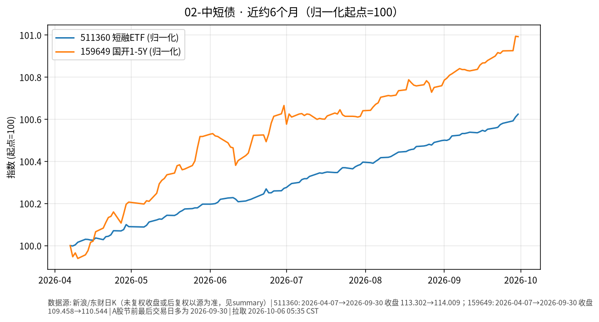

# 02-中短债日报 · 2026-10-06（周二）

> **市场日历**：国庆休市第 6 天，国内债券 ETF 与资金市场无新成交，上一交易日仍为 **2026-09-30**；预计 **10-08** 恢复（以公告为准）。美短端最新为美东 **10/5（周一）**。

## 市场状态

- 国内：511360 短融 ETF、159649 国开 1–5Y ETF 价格停在 9/30，没有新数据。
- 近 6 个月两条线依旧是缓慢向上的“票息爬坡”形态，波动很小。
- 海外短端：美 13 周国债收益率（^IRX）10/5 收 **4.018%**（+2.5 bp）；美 2Y 盘中约 4.80%–4.82%，基本持平（CNBC / CNBC TV18）。市场定价 10 月美联储按兵不动的概率约 77%–82%。

## 关键数据

| 指标 | 数值 | 日变化 | 数据时点 / 来源 |
| --- | --- | --- | --- |
| 511360 短融 ETF | 114.009 | +0.013% | 2026-09-30，新浪日 K |
| 159649 国开 1–5Y ETF | 110.544 | −0.002% | 2026-09-30，新浪日 K |
| 美 13 周国债 ^IRX | 4.018% | +2.5 bp | 美东 10/5，yfinance |
| 美 5Y（^FVX） | 5.066% | +1.1 bp | 美东 10/5，yfinance |
| 美 2Y | 约 4.82% | 约 −1 bp | 10/5 盘中，CNBC TV18 |

**近 6 个月**：511360 约 113.302（2026-04-07）→ 114.009，约 **+0.62%**；159649 约 109.458 → 110.544，约 **+0.99%**（未复权收盘）。

## 简要解读

1. 国内中短债假期没有价格变化，票息照常计提，净值类产品节后会一次性体现假期天数的利息。
2. 半年涨幅在 0.6%–1% 左右，说明这一类的收益主要来自票息，而不是价格波动。
3. 美国短端利率仍明显高于国内同期限，但涉及换汇、额度与汇率波动，这是渠道和路径问题，不是同一种资产。

## 关注点与风险

- 节后首周：央行公开市场逆回购续作、政府债发行缴款对短端资金面的影响。
- 节前取现资金回流的节奏。
- 短融/信用类 ETF 在流动性收紧时可能出现小幅折价。
- 本文仅陈述市场变化，不构成操作建议。

## 来源与时间

- 新浪财经日 K：511360、159649（拉取约 2026-10-06 05:35 CST）
- yfinance：^IRX、^FVX；CNBC / CNBC TV18：10/5 美 2Y 与 FedWatch 概率
- 图：`charts/2026-10-06-6m.png`，新浪未复权收盘，2026-04-07 → 2026-09-30，归一化起点=100
