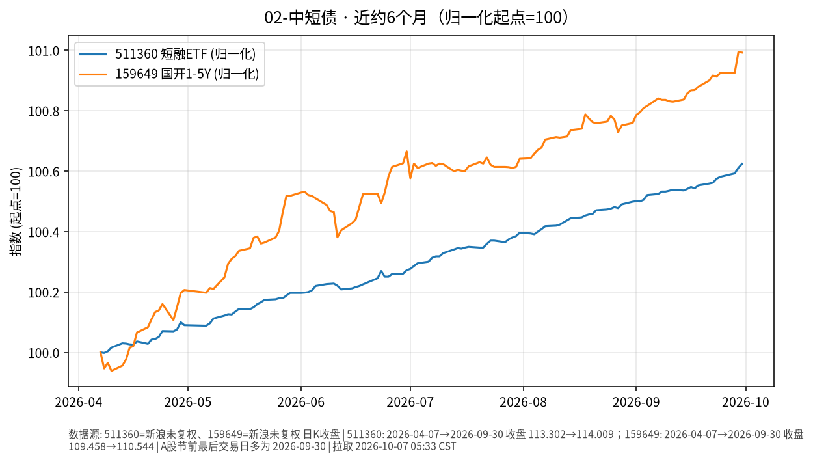

# 02-中短债日报 · 2026-10-07（周三）

> **市场日历**：国庆休市第 7 天（最后一天），国内债券 ETF 与资金市场无新成交，上一交易日仍为 **2026-09-30**；预计 **10-08** 恢复（以公告为准）。美短端最新为美东 **10/6（周二）**。

## 市场状态

- 国内：511360 短融 ETF、159649 国开 1–5Y ETF 价格仍停在 9/30，没有新数据。
- 近 6 个月两条线依旧是缓慢向上的“票息爬坡”形态，511360 几乎是一条直线，159649 在 6 月中旬、6 月底有过小幅回撤。
- 海外短端：美 13 周国债收益率（^IRX）10/6 收 **4.037%**（+1.9 bp）；美财政部 10/6 收益率曲线 2Y **4.79%**、3M **4.21%**。当天 580 亿美元 3 年期国债拍卖中标收益率 **4.932%**，为 2006 年 5 月以来最高，投标倍数 2.62（略低于近 6 次均值 2.65）（MarketWatch / Newsquawk）。

## 关键数据

| 指标 | 数值 | 日变化 | 数据时点 / 来源 |
| --- | --- | --- | --- |
| 511360 短融 ETF | 114.009 | +0.013% | 2026-09-30，新浪日 K |
| 159649 国开 1–5Y ETF | 110.544 | −0.002% | 2026-09-30，新浪日 K |
| 美 13 周国债 ^IRX | 4.037% | +1.9 bp | 美东 10/6，yfinance |
| 美 2Y | 4.79% | 约 −3 bp | 10/6，美国财政部收益率曲线；Kiplinger 盘后 4.798% |
| 美 5Y（^FVX） | 5.028% | −3.8 bp | 美东 10/6，yfinance |
| 美 3 年期拍卖中标收益率 | 4.932% | 较 9 月拍卖 4.474% +45.8 bp | 10/6，MarketWatch / Newsquawk |

**近 6 个月**：511360 约 113.302（2026-04-07）→ 114.009，约 **+0.62%**；159649 约 109.458 → 110.544，约 **+0.99%**（未复权收盘）。

## 简要解读

1. 国内中短债假期没有价格变化，票息照常计提，净值类产品节后会一次性体现假期天数的利息。
2. 半年涨幅在 0.6%–1% 左右，收益主要来自票息而不是价格波动；159649 久期略长，所以既涨得多一点，也有更明显的小回撤。
3. 美国短端利率比国内同期限高得多，而且 3 年期拍卖利率已到 20 年来高位；但从境内配置涉及换汇、额度与汇率波动，这是渠道和路径问题，不是同一种资产。

## 关注点与风险

- 节后首周：央行公开市场逆回购续作、政府债发行缴款对短端资金面的影响；节前取现资金回流的节奏。
- 美东 10/7 的美联储 9 月会议纪要（北京时间 10/8 02:00）可能改变市场对美国短端利率路径的定价，并通过汇率间接影响国内资金面预期；本文撰写时尚未公布。
- 短融/信用类 ETF 在流动性收紧时可能出现小幅折价。
- 本文只描述价格与机制，不构成买卖或加仓建议。

## 来源与时间

- 新浪财经日 K：511360、159649（拉取约 2026-10-07 05:33 CST）
- yfinance：^IRX、^FVX；美国财政部 Daily Treasury Par Yield Curve（10/06/2026）；MarketWatch、Newsquawk、TFTC：10/6 三年期拍卖；Kiplinger：10/6 盘后 2Y
- 图：`charts/2026-10-07-6m.png`，新浪未复权收盘，2026-04-07 → 2026-09-30，归一化起点=100
