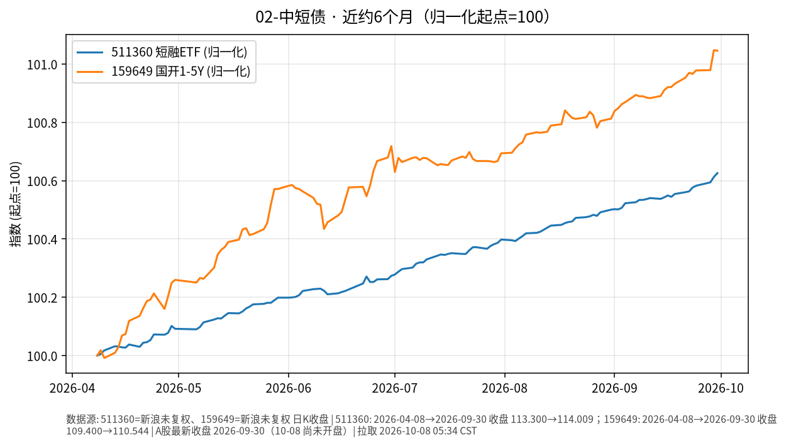

# 02-中短债日报 · 2026-10-08（周四）

> **市场日历**：今天是国庆节后首个交易日（上交所公告 **10-08 起照常开市**）。撰写时约 05:35 CST，国内尚未开盘，债券 ETF 与资金市场最新收盘仍是 **2026-09-30**。美短端最新为美东 **10/7（周三）**。

## 市场状态

- 国内：511360 短融 ETF、159649 国开 1–5Y ETF 价格仍停在 9/30，没有新数据；今天开盘后才会有节后第一笔成交。
- 近 6 个月两条线依旧是缓慢向上的“票息爬坡”形态：511360 几乎是一条直线，159649 在 6 月中旬、6 月底和 8 月下旬有过小幅回撤。
- 海外短端 10/7 基本走平：美 13 周国债收益率（^IRX）收 **4.037%**（持平）；美财政部收益率曲线 3M **4.22%**、1Y **4.42%**、2Y **4.77%**（较 10/6 −2 bp）。同日 10 年期拍卖强劲，美联储纪要显示多数官员认为年底前可能再加息一次（详见 03-国债）。

## 关键数据

| 指标 | 数值 | 日变化 | 数据时点 / 来源 |
| --- | --- | --- | --- |
| 511360 短融 ETF | 114.009 | +0.013% | 2026-09-30，新浪日 K |
| 159649 国开 1–5Y ETF | 110.544 | −0.002% | 2026-09-30，新浪日 K |
| 美 13 周国债 ^IRX | 4.037% | 持平 | 美东 10/7，yfinance |
| 美 3M / 1Y / 2Y | 4.22% / 4.42% / 4.77% | +1 / −4 / −2 bp | 10/7，美国财政部 Daily Par Yield Curve |
| 美 5Y（^FVX） | 5.021% | −0.7 bp | 美东 10/7，yfinance；财政部曲线 5.03% |
| CME FedWatch 加息概率 | 10 月约 19.4%，12 月约 83% | 10 月一周前约 38% | 10/7，Reuters 引述 |

**近 6 个月**：511360 约 113.300（2026-04-08）→ 114.009，约 **+0.63%**；159649 约 109.400 → 110.544，约 **+1.05%**（未复权收盘，至 9/30）。

## 简要解读

1. 国内中短债假期没有价格变化，票息照常计提；场内 ETF 价格与净值类产品节后会体现假期天数的利息。
2. 半年涨幅在 0.6%–1.05% 左右，收益主要来自票息而不是价格波动；159649 久期略长，所以涨得多一点，也有更明显的小回撤。
3. 美国短端在 10/7 几乎没动，变化集中在长端；美联储纪要强化的是“年底前可能再加息一次”，而 10 月当月加息概率已从约 38% 降到约 19%（CME FedWatch）。境内配置美国短端涉及换汇、额度与汇率波动，是渠道与路径问题，与国内中短债不是同一种资产。

## 关注点与风险

- 节后首日与首周：央行公开市场逆回购操作与到期规模、政府债发行缴款、节前取现资金回流节奏对短端资金面的影响。
- 短融/信用类 ETF 在流动性收紧时可能出现小幅折价；节后首日成交可能偏集中。
- 美国 9 月 CPI（北京时间 10/14 20:30）可能改变美国短端利率路径的定价，并通过汇率间接影响国内预期；本文撰写时尚未公布。
- 本文只描述价格与机制，不构成买卖或加仓建议。

## 来源与时间

- 新浪财经日 K：511360、159649（拉取 2026-10-08 05:34 CST）
- yfinance：^IRX、^FVX；美国财政部 Daily Treasury Par Yield Curve（10/07/2026，存于 data/us_treasury_par_curve_2026.csv）；Reuters（Global Banking & Finance 转载）：CME FedWatch；上证公告〔2026〕22 号：休市安排
- 图：`charts/2026-10-08-6m.png`，新浪未复权收盘，2026-04-08 → 2026-09-30，归一化起点=100
