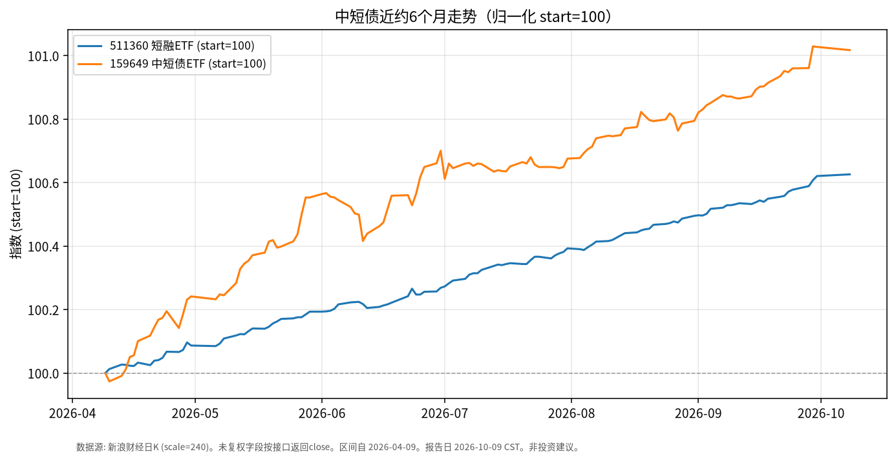

# 中短债日报 · 2026-10-09

> 日历说明：报告日 **2026-10-09（周五）清晨 CST**；A股 **10/8 已开市**（国庆 10/1–10/7 休市），当日盘前报告取 **2026-10-08** 收盘为最新。

## 1. 市场状态

- 节后首个交易日（10/8），短端利率债 ETF 价格波动极小：中证短融 ETF **511360** 几乎持平；部分中短债产品微跌。
- 银行间债市（公开债市日报）：10/8 利率债收益率普遍小幅上行约 **0.5 bp** 量级；公开市场单日净回笼规模较大，短端资金利率略上行——与短久期券价“窄幅整理”一致。
- 近半年维度：短融/中短债 ETF 价格缓升，波动显著小于权益与黄金。

## 2. 关键数据

| 标的 | 最新交易日 | 收盘 | 相对9/30（节前） | 近约1个月 | 近约6个月（自2026-04-09） |
|------|------------|------|------------------|-----------|---------------------------|
| **511360** 海富通中证短融ETF | 2026-10-08 | **114.015** | **+0.005%** | 约 +0.13% | 约 **+0.63%** |
| **159649** 中短债ETF（深市） | 2026-10-08 | **110.533** | **-0.010%** | 约 +0.19% | 约 **+1.02%** |

（新浪财经日K `close` 字段；图表为 start=100 归一化。）

## 3. 简要解读

- 10/8 短端 ETF 价格变动在 **万分之几～万五** 量级，符合短久期、票息主导的特征。
- 近 6 个月累计价格升幅约 **0.6%～1.0%**（未计入可能分红，需以基金公告为准），路径相对平滑。
- 资金面单日净回笼与收益率小幅上行，更多体现节后流动性脉冲，尚未在 ETF 价格上形成大幅回撤。

## 4. 关注点与风险

- **资金利率与公开市场操作**：跨季/节后回笼可能带来短端利率脉冲。
- **信用下沉差异**：短融指数成分以高等级短久期信用为主，但仍有信用利差波动风险。
- **净值与交易价**：ETF 二级市场价格可能相对 IOPV 出现短暂折溢价。
- 规模与流动性：公开信息显示 511360 近一年净申购居债券 ETF 前列（规模口径以基金公司披露为准）。

## 5. 来源与时间

- 行情：新浪财经日K —— **2026-10-09 约 06:30 CST** 拉取。
- 债市环境：新华财经/中经网《债市日报：10月8日》（银行间收益率、国债期货、资金面）。
- 休市安排：上交所 2026 年国庆休市通知。
- 声明：事实梳理，**非投资建议**。
