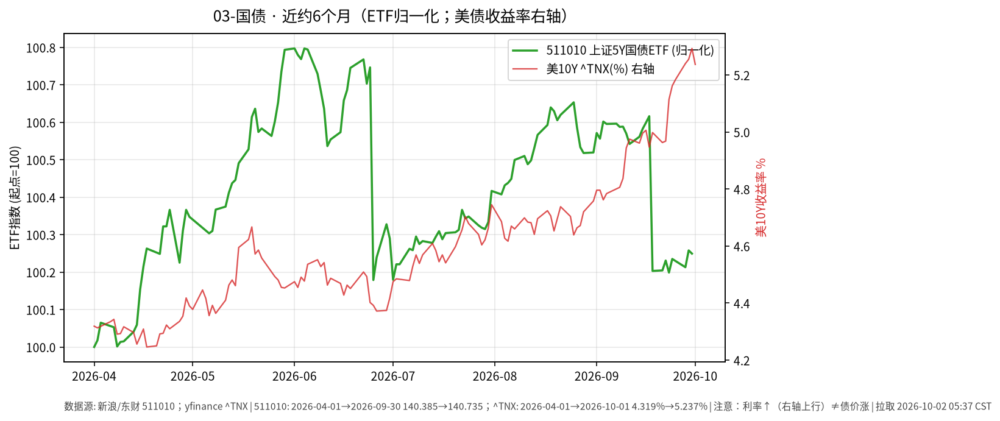

# 03-国债日报 · 2026-10-02

> **市场日历**：**国庆休市第 2 天**（国内国债现券/期货约休市至 **2026-10-07**，预计 **2026-10-08** 恢复）。撰写约 **05:35–05:40 CST**。中国利率债数据仍为**上一交易日 2026-09-30**；美国国债更新至**美东 2026-10-01** 收盘。

## 市场状态

- **国内利率债冻结**：10/1–10/2 无新成交。节前 9/30 为震荡回调日：10Y 活跃券约 **1.675%**（上行约 1.25 bp），国债期货全线收跌，超长端弹性更大。
- **美债 10/1：先冲高后回落**：10Y 盘中一度冲至约 **5.34%**（约二十余年高位），收盘回落至约 **5.23%–5.24%**（^TNX **5.237%**；DJ/Tradeweb 3pm 约 **5.233%**，当日约 **−5.9 bp**），终结连续多日上行。
- TLT 收 **77.71**（**−0.09%**），IEF 收 **89.30**（基本持平）；长端 ETF 波动小于收益率盘中振幅，反映收盘回吐。
- 中美 10Y 利差倒挂粗算约 **3.56 个百分点**（1.675 − 5.237）；境内配置美债仍需同时面对汇率、渠道与久期波动等路径事实。

## 关键数据

### 收益率

| 指标 | 数值 | 变化 | 数据时点 |
| --- | --- | --- | --- |
| 中国 10Y 国债活跃券 | **1.675%** | 上行 **1.25 bp**（相对 9/29） | 财联社/新华财经，**2026-09-30**；**10/1–10/2 无更新** |
| 中国 10Y 国开活跃券 | **1.754%** | 上行 **1 bp** | 财联社，9/30 |
| 中国 30Y 活跃券 | 约 **2.12%–2.122%** | 上行约 **1.3–1.5 bp** | 新华/财联社，9/30 |
| 美国 10Y（^TNX 收盘） | **5.237%** | 较 9/30 的 5.293% **−5.6 bp** | yfinance，美东 **2026-10-01** |
| 美国 10Y（DJ/Tradeweb 3pm） | **5.233%** | **−5.9 bp**；盘中高点约 **5.34%** | Morningstar-DJ，10/1 |
| 中美 10Y 利差（粗算） | 约 **−3.56 pct**（1.675 − 5.237） | 倒挂仍深 | 拼表估算 |

*未能获取：中国 2Y/10Y/30Y 活跃券 10/1–10/2 收益率（休市无成交）。*

### 国债期货（国内，仍为 9/30）

| 合约 | 收盘/涨跌 | 备注 | 时点 |
| --- | --- | --- | --- |
| 30 年期主力 | 跌 **0.58%**，报 **116.84** | 超长端调整最显著 | 财联社/新华，9/30 |
| 10 年期主力 | 跌 **0.19%**，报 **109.415** | — | 同上 |
| 5 年期主力 | 跌 **0.12%**，报 **106.46** | — | 同上 |
| 2 年期主力 | 跌 **0.04%**，报 **102.572** | — | 同上 |

### 国债 ETF / 美债代理

| 标的 | 收盘 | 日涨跌 | 时点 |
| --- | --- | --- | --- |
| 国泰上证 5Y 国债 ETF（511010） | **140.735** | **−0.009%**（9/30） | A 股节前最后交易日；**休市冻结** |
| 国泰 10Y 国债 ETF（511260） | **134.804** | **−0.071%**（9/30） | 同上 |
| 30Y 国债 ETF 鹏扬（511090） | **120.140** | **−0.389%**（9/30） | 同上 |
| 美债长端 ETF（TLT） | **77.71** | **−0.09%** | yfinance，美东 **2026-10-01** |
| 美债中端 ETF（IEF） | **89.30** | **−0.01%** | 同上 |

### 境内配置美债的路径事实（非推荐）

- 常见在岸渠道包括：**QDII 美债/美元债基金、部分跨境 ETF** 等；额度、申赎与汇率换算以销售机构当日规则为准。
- 价格波动来源至少包括：**美债久期（利率上行→净值回撤）** 与 **人民币兑美元汇率**；票息收益不等于持有期总回报。
- 本文仅描述路径事实，不评估性价比，不构成配置建议。

### 近约 6 个月轨迹（图）

- 图见上文：511010 归一化（左轴）+ 美 10Y ^TNX 收益率%（右轴）。
- **注意：右轴利率↑ ≠ 债价涨**；近月美债收益率抬升与国内 5Y ETF 相对平稳形成对照。

## 简要解读

1. 国内利率债在长假期间**无价格更新**；最新有效信息仍是 9/30 的技术性回调（10Y +1.25 bp，30Y 期货 −0.58%）。
2. 美债 10/1 呈现**盘中冲高、收盘回吐**：10Y 自约 5.34% 高点回落至约 5.23%，为近期最大单日收益率下行之一（DJ 口径），但绝对水平仍处多年高位区间。
3. TLT 仅微跌 **0.09%**，与收益率收盘回落基本一致，说明收盘定价已消化盘中抛压的一部分。
4. 中美利差倒挂仍深；境内投资者映射美债时，汇率与渠道摩擦是独立于票息的事实约束。
5. 国庆休市期间国际美债仍交易；10/8 国内开市时，需面对假期信息积累，本文不对跳空方向作判断。

## 关注点/风险

- **美国**：就业/通胀后续数据、财政部供给与 Fed 表态；10Y 若再度逼近 5.3%+，波动或升温。
- **中国**：节后开市供需、政府债供给、超长端拥挤度。
- **汇率与利差**：倒挂与汇率共同影响跨境配置叙事。
- **久期**：30Y 期货/ETF 对收益率小幅波动敏感。
- **不构成操作指引**。

## 来源与时间

- 新华财经/财联社：中国 10Y/30Y 与期货（2026-09-30）
- 新浪财经：511010/511260/511090（2026-09-30）
- yfinance：^TNX、TLT、IEF（约 **2026-10-02 05:38 CST**）
- Morningstar / Dow Jones：10Y 5.233%（2026-10-01 15:58 ET 电讯）
- 图表：`charts/03-国债-6m.png`（**利率↑线↑≠债价涨**）
- **本草稿仅为信息整理，不构成投资建议。未 push GitHub。**
