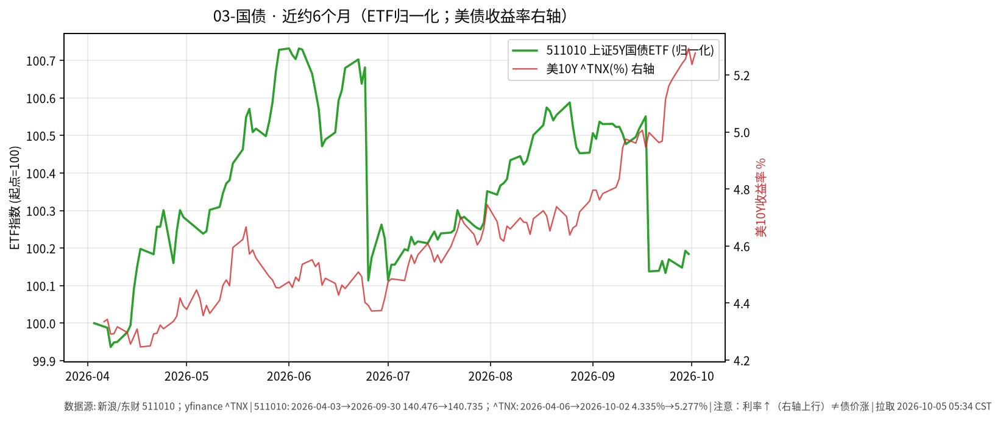

# 03-国债日报 · 2026-10-05（周一）

> **市场日历**：国庆休市第 5 天，国内利率债与国债 ETF 停在 **2026-09-30**；预计 **10-08** 恢复（以公告为准）。美债最新为美东 **10/2（周五）**。

## 市场状态

- 国内：511010 上证 5 年期国债 ETF 收 **140.735**（9/30，−0.009%）；无新成交。
- 美债：非农偏弱后 10Y 先跌到约 **5.157%**（一周低点），随后反转，收在约 **5.28%**（yfinance ^TNX 5.277%，+4.0 bp）；本周约 +10 bp，连续第五周上行（Reuters）。30Y 约 5.63%–5.64%。
- 美长债 ETF TLT 收 **77.48（−0.30%）**，本周约 −1.9%。

## 关键数据

| 指标 | 数值 | 日变化 | 数据时点 / 来源 |
| --- | --- | --- | --- |
| 511010 上证 5Y 国债 ETF | 140.735 | −0.009% | 2026-09-30，新浪日 K |
| 美 10Y（^TNX） | 5.277% | +4.0 bp | 美东 10/2，yfinance |
| 美 10Y（Reuters 收盘口径） | 约 5.281% | +4.7 bp | 10/2 |
| 美 30Y | 约 5.632% | +2.9 bp | 10/2，Reuters |
| TLT | 77.48 | −0.30% | 10/2，yfinance |
| IEF | 89.05 | −0.28% | 10/2，yfinance |

**近 6 个月**：511010 约 140.476（2026-04-03）→ 140.735，约 **+0.18%**；美 10Y 约 4.335% → 5.277%，上行约 **94 bp**；TLT 同期约 −8.5%。
图中 511010 在 2026-09-18 有一次单日约 −0.41% 的下台阶（数据为未复权收盘，是否与除息有关未核实）。图中右轴为美债收益率：**利率↑线↑≠债价涨**。

## 简要解读

1. 美债长端这周的主线是“数据利好也压不住收益率”：弱就业一度带来下行，但长端很快被通胀与供给担忧推回去。
2. 收益率上行 = 已持有债券的价格下跌，TLT 半年约 −8.5% 就是久期风险的直接体现。
3. 国内 5Y 国债 ETF 半年基本走平，波动远小于美债长端；两者驱动因素不同，不宜直接类比。
4. 中美 10Y 利差仍深度倒挂（国内 10Y 节前约 1.675%，粗算差约 3.6 个百分点）。

## 关注点与风险

- 美 10Y 是否站稳 5.3% 上方；10 月美联储会议预期。
- 国内节后：资金面、政府债供给节奏、节前利率回调是否延续。
- 通过 QDII 配置美债时还要叠加汇率与额度因素。
- 本文仅描述市场变化，不构成买卖建议。

## 来源与时间

- 新浪财经日 K：511010（拉取约 2026-10-05 05:34 CST）
- yfinance：^TNX、TLT、IEF；Reuters（经 Kitco 等转载）：10/2 美债走势
- 图：`charts/2026-10-05-6m.png`，511010 新浪未复权收盘（2026-04-03 → 09-30，归一化）+ yfinance ^TNX 右轴（2026-04-06 → 10-02）
