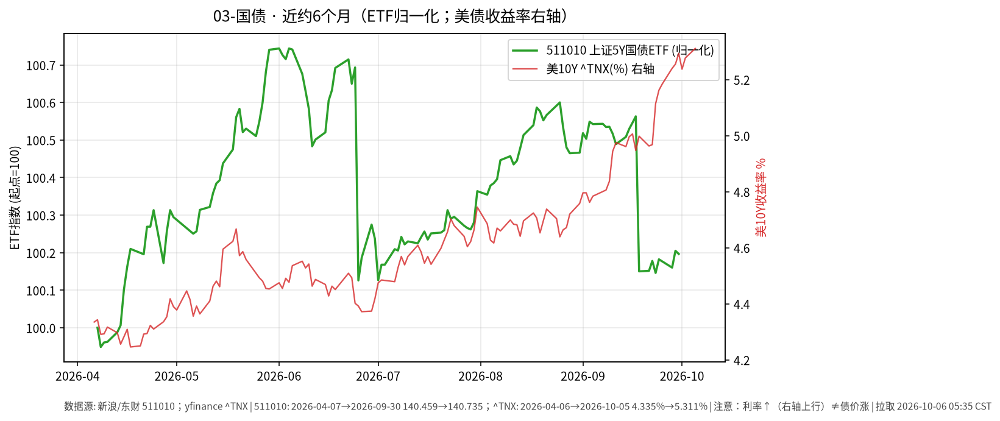

# 03-国债日报 · 2026-10-06（周二）

> **市场日历**：国庆休市第 6 天，国内利率债与国债 ETF 停在 **2026-09-30**；预计 **10-08** 恢复（以公告为准）。美债最新为美东 **10/5（周一）**。

## 市场状态

- 国内：511010 上证 5 年期国债 ETF 收 **140.735**（9/30，−0.009%）；无新成交。
- 美债：周一早盘 10Y 一度回落到约 **5.255%**，午后随 ISM 服务业价格指数走高而反弹，收在 **5.310%**（+3.4 bp），为 **2002 年 4 月以来最高**；过去 10 个交易日有 9 天上行（Dow Jones / Tradeweb）。
- 30Y 约 **5.665%**（+3.5 bp，yfinance ^TYX）；长债 ETF TLT 收 **77.11（−0.48%）**。

## 关键数据

| 指标 | 数值 | 日变化 | 数据时点 / 来源 |
| --- | --- | --- | --- |
| 511010 上证 5Y 国债 ETF | 140.735 | −0.009% | 2026-09-30，新浪日 K |
| 美 10Y（^TNX） | 5.311% | +3.4 bp | 美东 10/5，yfinance |
| 美 10Y（Dow Jones 收盘口径） | 5.310% | +3.4 bp | 10/5 15:00 ET，Tradeweb |
| 美 30Y（^TYX） | 5.665% | +3.5 bp | 10/5，yfinance |
| TLT | 77.11 | −0.48% | 10/5，yfinance |
| IEF | 88.92 | −0.15% | 10/5，yfinance |

**近 6 个月**：511010 约 140.459（2026-04-07）→ 140.735，约 **+0.20%**；美 10Y 约 4.335% → 5.311%，上行约 **98 bp**；TLT 同期约 −8.9%（复权）。图中右轴为美债收益率：**利率↑线↑≠债价涨**。

## 简要解读

1. 美债长端的主线仍是“通胀压力压过增长放缓”：上周非农很弱，但周一 ISM 服务业价格指数升到 74.0，收益率又被推回新高。
2. 收益率上行等于已持有债券的价格下跌，TLT 半年约 −8.9% 就是久期风险的直接体现。
3. 国内 5Y 国债 ETF 半年基本走平，波动远小于美债长端；两者驱动因素不同，不宜直接类比。
4. 中美 10Y 利差仍深度倒挂（国内 10Y 节前约 1.675%，粗算差约 3.6 个百分点）。

## 关注点与风险

- 本周三（美东 10/7）美联储 9 月会议纪要与 10 年期美债拍卖，周四 30 年期拍卖：需求强弱会直接影响长端利率。
- 国内节后：资金面、政府债供给节奏、节前利率回调是否延续。
- 通过 QDII 配置美债时还要叠加汇率与额度因素。
- 本文仅描述市场变化，不构成买卖建议。

## 来源与时间

- 新浪财经日 K：511010（拉取约 2026-10-06 05:35 CST）
- yfinance：^TNX、^TYX、TLT、IEF；Dow Jones（Morningstar 转载）、CNBC：10/5 美债走势；ISM 9 月服务业报告
- 图：`charts/2026-10-06-6m.png`，511010 新浪未复权收盘（2026-04-07 → 09-30，归一化）+ yfinance ^TNX 右轴（2026-04-06 → 10-05）
