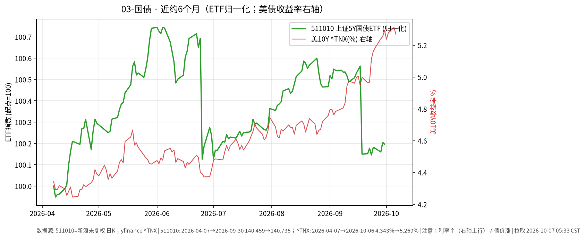

# 03-国债日报 · 2026-10-07（周三）

> **市场日历**：国庆休市第 7 天（最后一天），国内利率债与国债 ETF 停在 **2026-09-30**；预计 **10-08** 恢复（以公告为准）。美债最新为美东 **10/6（周二）**。

## 市场状态

- 国内：511010 上证 5 年期国债 ETF 收 **140.735**（9/30，−0.009%）；无新成交。
- 美债：周二长端从 24 年高位回落。10Y 收 **5.270%**（−4.0 bp，Tradeweb 15:00 ET 口径），结束两连涨；前一天盘中最高约 5.349%（WSJ）。欧元区国债收益率同步下行、油价走平，是当天债市压力缓和的背景（WSJ / Kiplinger）。
- 30Y 约 **5.641%**（−2.4 bp，yfinance ^TYX）；长债 ETF TLT 收 **77.28（+0.22%）**，IEF **89.13（+0.23%）**。
- 3 年期国债拍卖（580 亿美元）中标 **4.932%**，2006 年以来最高；投标倍数 2.62 略低于均值，外资等间接投标者占比 57.6%，低于近 12 个月均值约 63%（MarketWatch）。

## 关键数据

| 指标 | 数值 | 日变化 | 数据时点 / 来源 |
| --- | --- | --- | --- |
| 511010 上证 5Y 国债 ETF | 140.735 | −0.009% | 2026-09-30，新浪日 K |
| 美 10Y（^TNX） | 5.269% | −4.2 bp | 美东 10/6，yfinance |
| 美 10Y（Dow Jones 收盘口径） | 5.270% | −4.0 bp | 10/6 15:00 ET，Tradeweb |
| 美 10Y（财政部曲线） | 5.27% | 较 10/5 的 5.31% −4 bp | 10/6，美国财政部 |
| 美 30Y（^TYX） | 5.641% | −2.4 bp | 10/6，yfinance；财政部曲线 5.64% |
| TLT | 77.28 | +0.22% | 10/6，yfinance |
| IEF | 89.13 | +0.23% | 10/6，yfinance |

**近 6 个月**：511010 约 140.459（2026-04-07）→ 140.735，约 **+0.20%**；美 10Y 约 4.343% → 5.269%，上行约 **93 bp**；TLT 同期约 −8.7%（复权）。图中右轴为美债收益率：**利率↑线↑≠债价涨**。另注：511010 曲线在 6/25、9/18 各有一次约 0.4%–0.6% 的台阶式下跌（3/25 亦有一次），间隔约一个季度，形态与未复权价格的除息一致，但本文未核对基金分红公告。

## 简要解读

1. 周二美债回落的原因是外部压力缓和（欧洲债市反弹、油价走平、上周弱非农后加息预期降温），不是通胀数据转好；周一 ISM 服务业价格指数 74.0 的信号仍在。
2. 收益率回落 4 bp 对应 TLT 只涨约 0.2%，而半年 TLT 约 −8.7%，说明一天的回落对已发生的久期损失影响很小。
3. 国内 5Y 国债 ETF 半年基本走平，波动远小于美债长端；两者驱动因素不同，不宜直接类比。
4. 中美 10Y 利差仍深度倒挂（国内 10Y 节前约 1.67%–1.68%，沿用节前口径，粗算差约 3.6 个百分点）。

## 关注点与风险

- 美东 10/7（周三）13:00 ET 10 年期美债拍卖（约 390 亿美元），14:00 ET 美联储 9 月 15–16 日会议纪要（北京时间分别约 10/8 01:00、02:00）；10/8 还有 30 年期拍卖。三者均在本文撰写时尚未公布，需求强弱会直接影响长端利率。
- 国内节后：资金面、政府债供给节奏、节前利率走势是否延续。
- 通过 QDII 配置美债时还要叠加汇率与额度因素：利率回落时债价上涨，但人民币升值会抵消一部分以人民币计的回报（6 个月 yfinance CNY=X 约 6.882 → 6.692）。
- 本文只描述价格与机制，不构成买卖或加仓建议。

## 来源与时间

- 新浪财经日 K：511010（拉取约 2026-10-07 05:33 CST）
- yfinance：^TNX、^TYX、TLT、IEF、CNY=X；美国财政部 Daily Treasury Par Yield Curve（10/06/2026）；Dow Jones（Morningstar 转载）：10Y 收盘；WSJ、CNBC、Kiplinger：10/6 美债走势；MarketWatch / Newsquawk：3 年期拍卖；Helious：10 年期拍卖排期
- 图：`charts/2026-10-07-6m.png`，511010 新浪未复权收盘（2026-04-07 → 09-30，归一化）+ yfinance ^TNX 右轴（2026-04-07 → 10-06）
