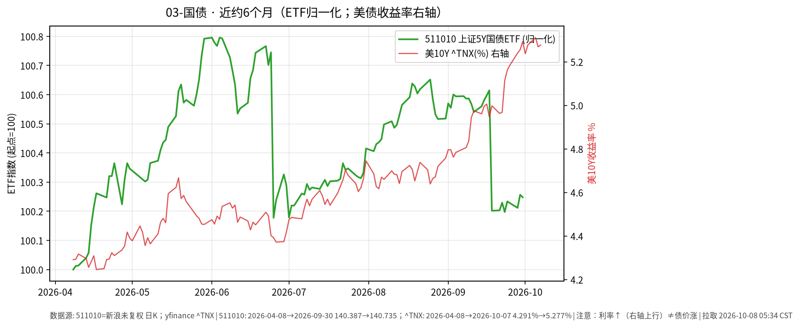

# 03-国债日报 · 2026-10-08（周四）

> **市场日历**：今天是国庆节后首个交易日（上交所公告 **10-08 起照常开市**）。撰写时约 05:35 CST，国内尚未开盘，国内利率债与国债 ETF 最新收盘仍是 **2026-09-30**。美债最新为美东 **10/7（周三）**。

## 市场状态

- 国内：511010 上证 5 年期国债 ETF 收 **140.735**（9/30，−0.009%）；假期无新成交。
- 美债：周三长端先创新高再回落。10Y 盘中一度升至约 **5.35%–5.365%**（2002 年以来最高），在 10 年期拍卖后回落，收盘 **5.276%**（+0.6 bp，Tradeweb 15:00 ET 口径）；30Y 盘中约 5.73%，收盘 yfinance ^TYX **5.661%**（+2.0 bp）。
- 10 年期拍卖（390 亿美元，北京时间 10/8 01:00）：中标收益率 **5.300%**，为 2000 年 11 月以来最高；低于发行前预发行（WI）5.317%，即“stop-through 1.7 bp”；投标倍数 **2.77**（均值约 2.54），间接投标（含外国央行等）**80.34%**，一级交易商仅获配 **2.54%**——多家机构评为需求强劲（investingLive / TFTC / CNBC 引述 BMO）。
- 美联储 9 月会议纪要（北京时间 10/8 02:00）：9 月一致加息 25 bp 至 3.75%–4.00%；多数与会者认为年底前再加息一次可能合适，未来决定取决于数据；有官员担心能源与 AI 投资相关的价格压力扩散（美联储官网 / Kitco / Axios）。
- 长债 ETF：TLT 收 **77.145（−0.17%）**，IEF **89.11（−0.02%）**。

## 关键数据

| 指标 | 数值 | 日变化 | 数据时点 / 来源 |
| --- | --- | --- | --- |
| 511010 上证 5Y 国债 ETF | 140.735 | −0.009% | 2026-09-30，新浪日 K |
| 美 10Y（Tradeweb 收盘口径） | 5.276% | +0.6 bp | 10/7 15:00 ET（北京 10/8 03:00），Dow Jones |
| 美 10Y（^TNX） | 5.277% | +0.8 bp | 美东 10/7，yfinance |
| 美 10Y（财政部曲线） | 5.28% | 较 10/6 的 5.27% +1 bp | 10/7，美国财政部 |
| 美 30Y（^TYX） | 5.661% | +2.0 bp | 10/7，yfinance；财政部曲线 5.67% |
| 10 年期拍卖中标收益率 | 5.300% | 较 9 月拍卖 4.834% +46.6 bp | 10/7 13:00 ET，TreasuryDirect（investingLive / TFTC 转述） |
| TLT | 77.145 | −0.17% | 10/7，yfinance |
| IEF | 89.11 | −0.02% | 10/7，yfinance（10/6 值由 89.125 修订为 89.13） |

**国庆假期外盘累计（9/30 → 10/7）**：美 10Y（^TNX）5.293% → 5.277%（约 −1.6 bp），30Y 5.638% → 5.661%（约 +2.3 bp）；TLT 77.468 → 77.145（约 −0.4%）。假期内 10Y 曾在 10/5 收到 5.311%（年内收盘高点附近）。

**近 6 个月**：511010 约 140.387（2026-04-08）→ 140.735，约 **+0.25%**（未复权）；美 10Y 约 4.291% → 5.277%，上行约 **99 bp**；TLT 同期约 −9.2%（复权，10/5 为区间收盘低点 77.11）。图中右轴为美债收益率：**利率↑线↑≠债价涨**。另注：511010 曲线在 6/25、9/18 各有一次约 0.4%–0.6% 的台阶式下跌，形态与未复权价格的除息一致，但本文未核对基金分红公告。

## 简要解读

1. 周三美债的特点是“盘中创新高、收盘基本走平”：拍卖需求强（尤其外资类间接投标占比约 80%）把 10Y 从约 5.36% 拉回到 5.28% 附近。
2. 纪要偏鹰，但内容与市场此前定价大体一致；10 月加息概率已从一周前约 38% 降到约 19%，12 月约 83%（CME FedWatch）。
3. 国内 5Y 国债 ETF 半年基本走平（+0.25%），波动远小于美债长端（TLT 半年约 −9.2%）；两者驱动因素不同，不宜直接类比。
4. 中美 10Y 利差仍深度倒挂（国内 10Y 节前约 1.67%–1.68%，沿用昨日日报的节前口径，本文未取到新值；粗算差约 3.6 个百分点）。

## 关注点与风险

- 美东 10/8（周四）13:00 ET 30 年期美债拍卖（约 220 亿美元，北京时间 10/9 01:00），同日财政部有 20–30 年期区间的回购（buyback）操作（UPI 引述 CNBC）；美国 9 月 CPI 北京时间 10/14 20:30 公布；FOMC 10/27–28。
- 国内节后：资金面、政府债供给节奏、节前利率走势是否延续；511010 今天的首笔成交会反映假期期间的信息。
- 通过 QDII 配置美债时还要叠加汇率与额度因素：利率回落时债价上涨，但人民币升值会抵消一部分以人民币计的回报（6 个月 yfinance CNY=X 约 6.857 → 6.693）。
- 本文只描述价格与机制，不构成买卖或加仓建议。

## 来源与时间

- 新浪财经日 K：511010（拉取 2026-10-08 05:34 CST）
- yfinance：^TNX、^TYX、TLT、IEF、CNY=X；美国财政部 Daily Treasury Par Yield Curve（10/07/2026）；Dow Jones（Morningstar 转载）：10Y 收盘；investingLive、TFTC、SquawkNews：10 年期拍卖；UPI、Invezz：盘中高点与 30 年期拍卖排期；美联储官网、Kitco、Axios：9 月会议纪要；Reuters：FedWatch
- 图：`charts/2026-10-08-6m.png`，511010 新浪未复权收盘（2026-04-08 → 09-30，归一化）+ yfinance ^TNX 右轴（2026-04-08 → 10-07）
