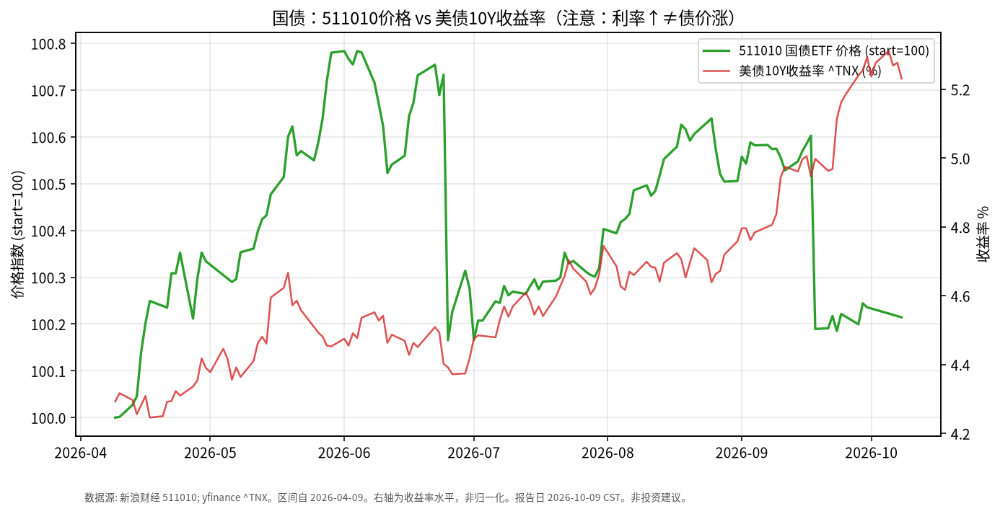

# 国债日报 · 2026-10-09

> 日历说明：报告日 **2026-10-09 清晨 CST**；国内价格取 **2026-10-08**；美债收益率取 **2026-10-08**。**注意：收益率上行对应债券价格承压，图中右轴利率↑并不表示债价上涨。**

## 1. 市场状态

- 国内：国泰上证 5 年期国债 ETF **511010** 10/8 收盘 **140.705**，较 9/30 **140.735** 约 **-0.021%**。
- 银行间：10 年期国债收益率报约 **1.682%**（较前一交易日约 **+0.45 bp**）；国债期货 10 年期主力约跌 0.05%。
- 海外对照：美债 10 年期 ^TNX 10/8 收于约 **5.231%**，较 10/7 的 **5.277%** 回落约 **4.6 bp**；近月曾触及约 **5.35%** 一带（公开报道称接近 2002 年以来高位）。
- 内外利率水平差仍大：国内长端利率低位窄幅波动，美债长端高位震荡——分属不同宏观定价体系。

## 2. 关键数据

| 标的 | 最新交易日 | 水平 | 变动 | 近约6个月 |
|------|------------|------|------|-----------|
| **511010** 价格 | 2026-10-08 | **140.705** | -0.021%（相对9/30） | 约 **+0.21%**（自4/9） |
| 中国 10Y 国债收益率（公开债市日报） | 2026-10-08 | 约 **1.682%** | 约 +0.45 bp | — |
| 美债 10Y ^TNX | 2026-10-08 | **5.231%** | 约 -4.6 bp（相对10/7） | 自约 4.29% 升至 5.23%（水平变化约 +94 bp） |

图表：左轴 511010 价格归一化 start=100；右轴 ^TNX 收益率（%）——**利率轴上升 ≠ 债价上涨**。

## 3. 简要解读

- 511010 近半年价格几乎走平略升（约 +0.2%），体现中短久期利率债在国内低波动环境中的路径。
- 10/8 国内利率小幅上行、ETF 价格微跌，方向一致。
- 美债收益率近半年显著抬升，与黄金回撤同期出现，属跨资产事实关联，不构成操作指令。

## 4. 关注点与风险

- **久期**：5 年期国债 ETF 对利率变动敏感度高于短融，但低于超长债。
- **财政与供给**：特别国债/地方债供给节奏可能扰动利率曲线。
- **海外溢出**：美债波动对国内利率的传导不稳定，需分市场观察。
- 期货与现券、ETF 价格可能短期不一致。

## 5. 来源与时间

- 511010：新浪财经日K；^TNX：yfinance —— **2026-10-09 约 06:30 CST**。
- 国内收益率与期货：新华财经《债市日报：10月8日》。
- 美债高位叙述：公开财经报道（Invezz / FXStreet / USAGOLD 等，2026-10-08）。
- 声明：事实梳理，**非投资建议**。
