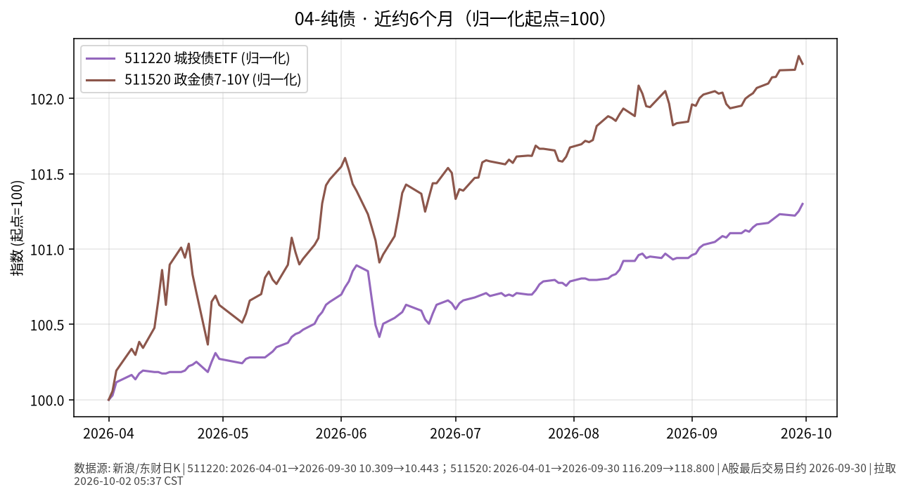

# 04-纯债日报 · 2026-10-02

> **市场日历**：**国庆休市第 2 天**（约 **2026-10-01 至 2026-10-07**，预计 **2026-10-08** 恢复）。撰写约 **05:35–05:40 CST**。信用债与纯债相关代理行情以 **A 股上一交易日 2026-09-30** 为主；海外公司债 ETF 更新至美东 **2026-10-01**。本门类聚焦**信用债/纯债基金环境**，与「03-国债」（利率债）区分。

## 市场状态

- **国内信用/纯债代理冻结**：10/1–10/2 无成交。节前 9/30 在利率债回调背景下，城投 ETF 微涨、政金债 7–10Y ETF 微跌，信用二级未现显著利差被动走阔。
- **海外信用债 10/1**：LQD 收 **102.03**（**−0.15%**），HYG 收 **76.90**（**−0.40%**）；美债长端收益率盘中冲高后回落，信用债 ETF 仍小幅回撤，高收益端跌幅略大。
- 长假期间国内理财/基金无二级交易；开市初的赎回与流动性分层是常见机制性关注点（非预测）。

## 关键数据

### 国内信用/政策金融债代理标的（仍为 9/30）

| 标的 | 收盘 | 日涨跌 | 属性说明 | 时点 |
| --- | --- | --- | --- | --- |
| 城投债 ETF 海富通（511220） | **10.443** | **+0.048%**（前收 10.438） | 上证城投债方向；**休市冻结** | 新浪，**2026-09-30** |
| 政金债 7–10Y ETF 富国（511520） | **118.800** | **−0.050%**（前收 118.860） | 政策性金融债 | 同上 |
| 短融 ETF（511360） | **114.009** | **+0.013%** | 短端信用票据 | 同上 |
| 国开 1–5Y ETF（159649） | **110.544** | **−0.002%** | 国开债（准利率） | 同上 |

### 利率锚与资金（环境对照，9/30）

| 项目 | 内容 | 来源时点 |
| --- | --- | --- |
| 10Y 国债活跃券 | **1.675%**（上行 1.25 bp） | 财联社/新华财经，9/30 |
| 30Y 活跃券 | 约 **2.12%–2.122%** | 同上 |
| 公开市场 | 净投放约 **1,270 亿元** | 新华财经，9/30 |
| 中证转债指数 | **468.98**，跌 **0.14%** | 新华财经债市日报，9/30 |
| 信用利差环境（背景） | 公开周报曾描述 AAA- 二永债利差分位数处极低水平；机构观点提示债市赔率不佳 | 节前公开材料 |

### 海外公司债对照（美东 10/1）

| 标的 | 收盘 | 日涨跌 | 备注 |
| --- | --- | --- | --- |
| LQD（投资级公司债 ETF） | **102.03** | **−0.15%** | 较 9/30 的 102.18 |
| HYG（高收益债 ETF） | **76.90** | **−0.40%** | 较 9/30 的 77.21；回撤大于 LQD |

*未能获取：中债 AAA 企业债/中票 10/1–10/2 曲线（休市）；全市场纯债基金指数节假日点位；主动纯债基金最新净值排行。*

### 近约 6 个月轨迹（图）

- 图见上文：511220 与 511520 归一化（起点=100），约 **2026-04-01 → 2026-09-30**。
- 两条曲线整体低波上行，政金债久期略长时波动略大于城投代理。

## 简要解读

1. 国内纯债代理在长假中**无新价格**；最新有效对比仍是 9/30：利率债回调时城投 ETF **+0.05%**、政金债 ETF **−0.05%**，属低波分化而非利差危机。
2. 美信用债 10/1 小幅回撤，HYG 跌幅大于 LQD，与美债收益率盘中冲高、风险偏好分层的机制一致；对国内纯债主要是情绪对照，非直接估值锚定。
3. 利差处于公开描述的历史极低分位附近时，纯债超额更依赖**票息与骑乘**，而非继续大幅压缩利差。
4. 节后开市初，理财/基金赎回与流动性折价是固收类常见机制性风险，本报告仅作事实提示。
5. 本门类与「03-国债」区分：此处跟踪信用/准信用代理，利率债久期风险见国债门类。

## 关注点/风险

- **利差过窄**：安全垫薄，负面消息易引发超调。
- **城投与隐债政策**：再融资与监管节奏变化影响板块估值。
- **理财/基金赎回**：长假后开市初流动性折价风险。
- **久期错配**：部分“纯债”拉长久期博资本利得，利率上行时回撤大于短债。
- **评级与永续/二永**：下沉品种需单独跟踪。
- **不构成操作指引**。

## 来源与时间

- 新浪财经：511220、511520、511360、159649（**2026-09-30**）
- 新华财经债市日报（2026-09-30）
- yfinance：LQD、HYG（约 **2026-10-02 05:38 CST**）
- 图表：`charts/04-纯债-6m.png`
- **本草稿仅为信息整理，不构成投资建议。未 push GitHub。**
