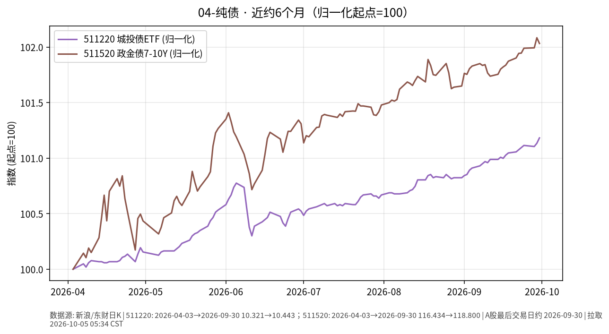

# 04-纯债日报 · 2026-10-05（周一）

> **市场日历**：国庆休市第 5 天，国内信用/政金债 ETF 停在 **2026-09-30**；预计 **10-08** 恢复（以公告为准）。美信用债 ETF 最新为美东 **10/2**。

## 市场状态

- 国内：511220 城投债 ETF 收 **10.443**、511520 政金债 ETF 收 **118.800**（均为 9/30），假期无新成交。
- 近 6 个月：两条线都在缓慢抬升，政金债（久期更长）涨幅略大、波动也略大。
- 美信用债 10/2：投资级 LQD **101.83（−0.20%）**，高收益 HYG **76.91（+0.01%）**——投资级受利率上行拖累更明显，高收益端受“股市上涨”支撑基本持平。

## 关键数据

| 指标 | 数值 | 日变化 | 数据时点 / 来源 |
| --- | --- | --- | --- |
| 511220 城投债 ETF | 10.443 | +0.05% | 2026-09-30，新浪日 K |
| 511520 政金债 ETF | 118.800 | −0.05% | 2026-09-30，新浪日 K |
| LQD 美投资级 | 101.83 | −0.20%（本周约 −0.9%） | 美东 10/2，yfinance |
| HYG 美高收益 | 76.91 | +0.01%（本周约 −0.8%） | 美东 10/2，yfinance |

**近 6 个月**：511220 约 10.321（2026-04-03）→ 10.443，约 **+1.18%**；511520 约 116.434 → 118.800，约 **+2.03%**（未复权收盘）。同期 LQD 约 −4.3%、HYG 约 −0.6%（复权）。

## 简要解读

1. 国内纯债类假期冻结，半年走势仍是“慢涨、回撤浅”。
2. 美国这边，投资级信用债的价格更多由国债利率决定，长端利率上行时它会一起跌；高收益债更像“半股半债”，跟股市情绪联动。
3. 两地对比再次说明：同样叫“债”，久期和利率环境不同，路径完全不一样。

## 关注点与风险

- 国内节后：利率债若延续节前回调，政金债类波动会大于城投短久期。
- 信用债 ETF 在赎回集中时可能有流动性折价。
- 美长端利率是美信用债价格的主要压力源。
- 本文仅陈述市场变化，不构成操作建议。

## 来源与时间

- 新浪财经日 K：511220、511520（拉取约 2026-10-05 05:34 CST）
- yfinance：LQD、HYG
- 图：`charts/2026-10-05-6m.png`，新浪日 K 未复权收盘，2026-04-03 → 2026-09-30，归一化起点=100
