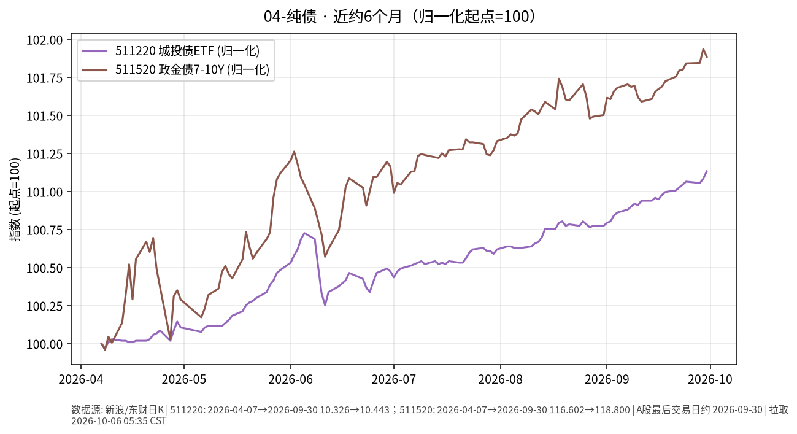

# 04-纯债日报 · 2026-10-06（周二）

> **市场日历**：国庆休市第 6 天，国内信用债与政金债 ETF 停在 **2026-09-30**；预计 **10-08** 恢复（以公告为准）。美信用债最新为美东 **10/5（周一）**。

## 市场状态

- 国内：511220 城投债 ETF 收 **10.443**、511520 政金债 ETF 收 **118.800**（均为 9/30），假期无新成交。
- 近 6 个月：两条线都在缓慢抬升，政金债（久期更长）涨幅略大、波动也略大。
- 美信用债 10/5：投资级 LQD **101.83（持平）**，高收益 HYG **76.98（+0.09%）**；同日美股标普 500 收约 **7,774（+0.66%）**，高收益端跟着风险情绪略涨。

## 关键数据

| 指标 | 数值 | 日变化 | 数据时点 / 来源 |
| --- | --- | --- | --- |
| 511220 城投债 ETF | 10.443 | +0.05% | 2026-09-30，新浪日 K |
| 511520 政金债 ETF | 118.800 | −0.05% | 2026-09-30，新浪日 K |
| LQD 美投资级 | 101.83 | 0.00% | 美东 10/5，yfinance |
| HYG 美高收益 | 76.98 | +0.09% | 美东 10/5，yfinance |

**近 6 个月**：511220 约 10.326（2026-04-07）→ 10.443，约 **+1.13%**；511520 约 116.602 → 118.800，约 **+1.89%**（未复权收盘）。

## 简要解读

1. 国内纯债类假期冻结，半年走势仍是“慢涨、回撤浅”。
2. 美国投资级信用债的价格主要跟着国债利率走，周一 10Y 再创新高但 LQD 持平，说明信用利差暂时没有扩大；高收益债更像“半股半债”，跟股市情绪联动。
3. 同样叫“债”，久期和利率环境不同，路径完全不一样。

## 关注点与风险

- 国内节后信用债供给、城投相关政策与资金面。
- 政金债久期更长，对利率变动更敏感：利率上行时回撤也会更大。
- ETF 场内价格与净值可能有小幅偏离。
- 本文仅陈述市场变化，不构成操作建议。

## 来源与时间

- 新浪财经日 K：511220、511520（拉取约 2026-10-06 05:35 CST）
- yfinance：LQD、HYG、^GSPC
- 图：`charts/2026-10-06-6m.png`，新浪未复权收盘，2026-04-07 → 2026-09-30，归一化起点=100
