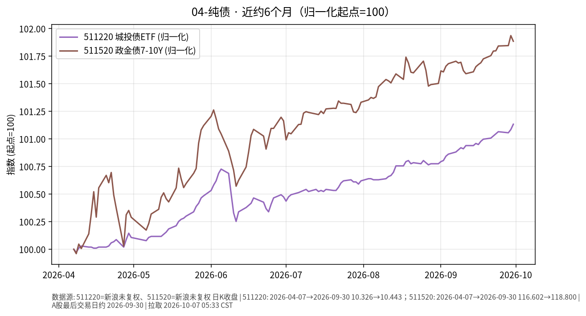

# 04-纯债日报 · 2026-10-07（周三）

> **市场日历**：国庆休市第 7 天（最后一天），国内信用债与政金债 ETF 停在 **2026-09-30**；预计 **10-08** 恢复（以公告为准）。美信用债最新为美东 **10/6（周二）**。

## 市场状态

- 国内：511220 城投债 ETF 收 **10.443**、511520 政金债 ETF 收 **118.800**（均为 9/30），假期无新成交。
- 近 6 个月：两条线都在缓慢抬升；政金债（7–10 年，久期更长）涨幅更大，6 月上中旬回撤也更明显。
- 美信用债 10/6：投资级 LQD **102.14（+0.30%）**，高收益 HYG **77.27（+0.38%）**；同日美 10Y 回落 4 bp、标普 500 收 **7,818.93（+0.58%）**，创年内第 28 个收盘新高（Dow Jones）。

## 关键数据

| 指标 | 数值 | 日变化 | 数据时点 / 来源 |
| --- | --- | --- | --- |
| 511220 城投债 ETF | 10.443 | +0.05% | 2026-09-30，新浪日 K |
| 511520 政金债 ETF | 118.800 | −0.05% | 2026-09-30，新浪日 K |
| LQD 美投资级 | 102.14 | +0.30% | 美东 10/6，yfinance |
| HYG 美高收益 | 77.27 | +0.38% | 美东 10/6，yfinance |
| 美 10Y（^TNX） | 5.269% | −4.2 bp | 美东 10/6，yfinance |

**近 6 个月**：511220 约 10.326（2026-04-07）→ 10.443，约 **+1.13%**；511520 约 116.602 → 118.800，约 **+1.89%**（未复权收盘）。对照：LQD 同期约 **−4.1%**、HYG 约 **−0.2%**（yfinance 复权）。

## 简要解读

1. 国内纯债类假期冻结，半年走势仍是“慢涨、回撤浅”。
2. 美国投资级信用债主要跟着国债利率走：周二 10Y 回落，LQD 随之上涨约 0.3%；但半年下来 LQD 仍约 −4%，与美 10Y 上行约 93 bp 方向一致。
3. 高收益债 HYG 更像“半股半债”，跟股市情绪联动；半年基本走平，是票息与利率上行相互抵消的结果。
4. 同样叫“债”，久期、信用和利率环境不同，路径完全不一样。

## 关注点与风险

- 国内节后信用债供给、城投相关政策与资金面。
- 政金债久期更长，对利率变动更敏感：利率上行时回撤也会更大。
- 美东 10/7 的 10 年期美债拍卖与美联储会议纪要（北京时间 10/8 凌晨）可能影响美国长端利率，进而影响美元信用债价格；本文撰写时尚未公布。
- ETF 场内价格与净值可能有小幅偏离。
- 本文只描述价格与机制，不构成买卖或加仓建议。

## 来源与时间

- 新浪财经日 K：511220、511520（拉取约 2026-10-07 05:33 CST）
- yfinance：LQD、HYG、^TNX、^GSPC；Dow Jones（Morningstar 转载）、WSJ：10/6 美股收盘
- 图：`charts/2026-10-07-6m.png`，新浪未复权收盘，2026-04-07 → 2026-09-30，归一化起点=100
