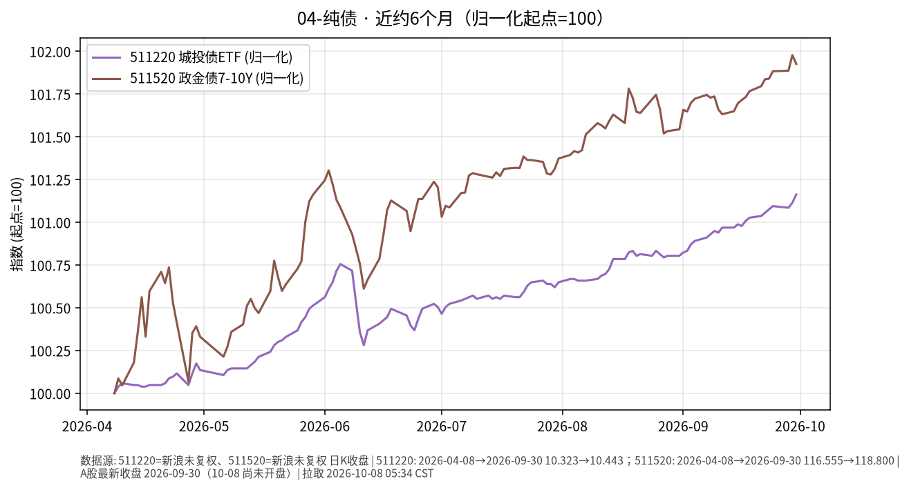

# 04-纯债日报 · 2026-10-08（周四）

> **市场日历**：今天是国庆节后首个交易日（上交所公告 **10-08 起照常开市**）。撰写时约 05:35 CST，国内尚未开盘，信用债与政金债 ETF 最新收盘仍是 **2026-09-30**。美信用债最新为美东 **10/7（周三）**。

## 市场状态

- 国内：511220 城投债 ETF 收 **10.443**、511520 政金债 ETF 收 **118.800**（均为 9/30），假期无新成交。
- 近 6 个月：两条线都在缓慢抬升；政金债（7–10 年，久期更长）涨幅更大，6 月上中旬、8 月下旬回撤也更明显。
- 美信用债 10/7 小幅回落：投资级 LQD **102.10（−0.04%）**，高收益 HYG **77.18（−0.12%）**；同日美 10Y 盘中创 2002 年以来新高后收在 5.276%（+0.6 bp），标普 500 收 **7,801.77（−0.22%）**，道指 −0.66%（yfinance / Invezz）。

## 关键数据

| 指标 | 数值 | 日变化 | 数据时点 / 来源 |
| --- | --- | --- | --- |
| 511220 城投债 ETF | 10.443 | +0.05% | 2026-09-30，新浪日 K |
| 511520 政金债 ETF | 118.800 | −0.05% | 2026-09-30，新浪日 K |
| LQD 美投资级 | 102.10 | −0.04% | 美东 10/7，yfinance |
| HYG 美高收益 | 77.18 | −0.12% | 美东 10/7，yfinance |
| 美 10Y（Tradeweb） | 5.276% | +0.6 bp | 10/7 15:00 ET，Dow Jones |
| 标普 500 | 7,801.77 | −0.22% | 美东 10/7，yfinance |

**国庆假期外盘累计（9/30 → 10/7）**：LQD 101.741 → 102.10（约 +0.35%），HYG 76.868 → 77.18（约 +0.41%）；同期美 10Y 基本持平（约 −1.6 bp）。

**近 6 个月**：511220 约 10.323（2026-04-08）→ 10.443，约 **+1.16%**；511520 约 116.555 → 118.800，约 **+1.93%**（未复权收盘，至 9/30）。对照：LQD 同期约 **−4.5%**、HYG 约 **−0.9%**（yfinance 复权，至 10/7）。

## 简要解读

1. 国内纯债类假期冻结，半年走势仍是“慢涨、回撤浅”。
2. 美国投资级信用债主要跟着国债利率走：10/7 利率收盘基本持平，LQD 也基本不动；半年下来 LQD 约 −4.5%，与美 10Y 上行约 99 bp 方向一致。
3. 高收益债 HYG 更像“半股半债”，跟股市情绪联动；10/7 美股小跌，HYG 也小跌；半年接近走平，是票息与利率上行相互抵消的结果。
4. 同样叫“债”，久期、信用和利率环境不同，路径完全不一样。

## 关注点与风险

- 国内节后信用债供给、城投相关政策与资金面；今天开盘是两只 ETF 节后首次定价。
- 政金债久期更长，对利率变动更敏感：利率上行时回撤也会更大。
- 美国长端利率仍在高位（10Y 盘中触及约 5.36%），30 年期拍卖（北京时间 10/9 01:00）与 9 月 CPI（北京时间 10/14 20:30）可能影响美元信用债价格。
- ETF 场内价格与净值可能有小幅偏离。
- 本文只描述价格与机制，不构成买卖或加仓建议。

## 来源与时间

- 新浪财经日 K：511220、511520（拉取 2026-10-08 05:34 CST）
- yfinance：LQD、HYG、^TNX、^GSPC；Dow Jones（Morningstar 转载）：10Y 收盘；Invezz（Reuters/CNBC 数据）：10/7 美股收盘与盘中利率高点；上证公告〔2026〕22 号：休市安排
- 图：`charts/2026-10-08-6m.png`，新浪未复权收盘，2026-04-08 → 2026-09-30，归一化起点=100
