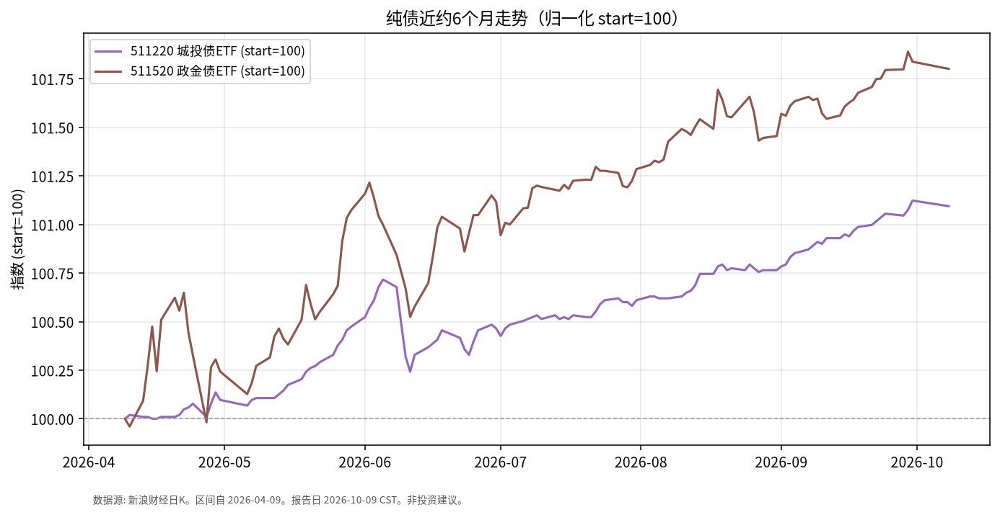

# 纯债日报 · 2026-10-09

> 日历说明：报告日 **2026-10-09 清晨 CST**；最新收盘 **2026-10-08**（国庆后首个交易日）。

## 1. 市场状态

- 城投债 ETF **511220**、政金债相关 **511520** 在 10/8 均小幅下跌（约 -0.03%～-0.04%），与利率债收益率略上行的背景一致。
- 近半年价格累计仍温和上行：信用/政金债 ETF 的价格升幅高于 5 年国债 ETF，反映票息累积与利差环境。
- 公开信息：近一年债券 ETF 净申购排名中，511360、511220 等居前（规模与申赎以官方披露为准）——描述资金流向事实，不评价好坏。

## 2. 关键数据

| 标的 | 最新交易日 | 收盘 | 相对9/30 | 近约1个月 | 近约6个月（自2026-04-09） |
|------|------------|------|----------|-----------|---------------------------|
| **511220** 海富通上证城投债ETF | 2026-10-08 | **10.440** | **-0.029%** | 约 +0.30% | 约 **+1.09%** |
| **511520**（政金债ETF，新浪代码） | 2026-10-08 | **118.757** | **-0.036%** | 约 +0.24% | 约 **+1.80%** |

图表为二者归一化 start=100。

## 3. 简要解读

- 节后首日纯债 ETF 价格变动幅度很小，属于利率轻微上行下的正常价格反应。
- 近 6 个月 511220 约 +1.1%、511520 约 +1.8%（二级市场 close，未单独拆分红），路径明显平滑于权益与黄金。
- 信用利差与利率是双重驱动；本报告仅列价格变化，不推断利差是否“便宜/贵”。

## 4. 关注点与风险

- **信用事件与评级迁移**：城投区域分化仍是信用债固有风险。
- **流动性与折溢价**：部分债券 ETF 成交不如宽基股票 ETF，大额交易需关注冲击。
- **利率上行**：若国内利率趋势性上行，中长久期纯债价格回撤可能放大。
- **分红与复权**：长期比较应核对基金分红与复权口径。

## 5. 来源与时间

- 行情：新浪财经日K —— **2026-10-09 约 06:30 CST**。
- 债市环境：新华财经《债市日报：10月8日》。
- 净申购排名背景：新浪财经 2026-10-08 债券 ETF 净申购报道（描述性）。
- 声明：事实梳理，**非投资建议**。
