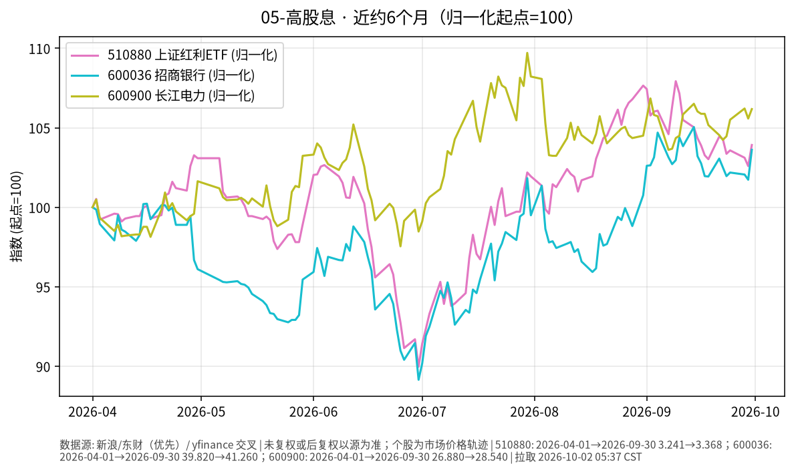

# 05-高股息日报 · 2026-10-02

> **市场日历**：**国庆休市第 2 天**（A 股 / 沪深港通约 **2026-10-01 至 2026-10-07** 休市，预计 **2026-10-08** 恢复）。撰写约 **05:35–05:40 CST**，无 10/2 成交。行情均为**上一交易日 2026-09-30（节前最后交易日）**。示例标的：招商银行（600036）、长江电力（600900）；红利代理：上证红利 ETF（510880）。国际对照：美债利率见「03-国债」（美东 10/1 有更新）。

## 市场状态

- **A 股冻结**：10/1–10/2 无成交、无指数更新。节前 9/30 **涨跌互现**：上证 **3842.19（+0.31%）**，深成指 **12887.62（−0.11%）**，创业板指 **3135.28（−0.23%）**；两市成交约 **1.44–1.45 万亿元**。
- 高股息样本 9/30 偏强：招行 **+1.85%**，长电 **+0.56%**，红利 ETF **+1.29%**，均显著强于大盘。
- 假期期间外盘（美债收益率盘中冲高回落、黄金收涨等）可能在 10/8 开盘映射为情绪与资金面扰动；**本报告不预测跳空方向**。

## 关键数据

| 标的 | 收盘价 | 日涨跌 | 其他 | 时点 |
| --- | --- | --- | --- | --- |
| 招商银行 600036 | **41.26 元** | **+1.85%**（+0.75 元） | 昨收 40.51；**10/1–10/2 无成交** | 新浪，**2026-09-30** |
| 长江电力 600900 | **28.54 元** | **+0.56%**（+0.16 元） | 昨收 28.38；休市冻结 | 同上 |
| 上证红利 ETF 510880 | **3.368** | **+1.29%**（前收 3.325） | 休市冻结 | 同上 |
| 上证指数（对照） | **3842.19** | **+0.31%** | 节前最后交易日 | 新浪/同花顺，9/30 |
| 深证成指（对照） | **12887.62** | **−0.11%** | — | 同上 |
| 创业板指（对照） | **3135.28** | **−0.23%** | — | 同上 |
| 两市成交额 | 约 **1.44–1.45 万亿元** | 较上日约 **+285～288 亿元** | 不同媒体口径略异 | 同花顺等，9/30 |
| 国内 10Y 国债（对照） | **1.675%** | 上行 1.25 bp | 红利“类债”相对利差环境；休市无更新 | 财联社/新华，9/30 |
| 美债 10Y（环境对照） | **5.237%**（^TNX） | 较 9/30 **−5.6 bp** | 仅作全球利率环境参照 | yfinance，美东 **2026-10-01** |

### 近几日收盘轨迹（至节前最后交易日）

| 日期 | 招行 600036 | 长电 600900 | 红利 ETF 510880 |
| --- | --- | --- | --- |
| 2026-09-22 | 40.82 | 28.02 | 3.380 |
| 2026-09-23 | 40.60 | 28.08 | 3.350 |
| 2026-09-24 | 40.69 | 28.36 | 3.357 |
| 2026-09-28 | 40.64 | 28.55 | 3.342 |
| 2026-09-29 | 40.51 | 28.38 | 3.325 |
| 2026-09-30 | **41.26** | **28.54** | **3.368** |
| 2026-10-01 / 10-02 | **休市** | **休市** | **休市** |

*未能获取：一致口径的实时股息率；510880 官方 IOPV/折溢价；港股通标的 10/1–10/2 有效对照（港股通随 A 股休市）。*

### 近约 6 个月轨迹（图）

- 图见上文：510880、600036、600900 归一化（起点=100），约 **2026-04-01 → 2026-09-30**。
- 三条轨迹分化明显：个股与红利 ETF 弹性大于纯债/中短债门类，属权益波动量级。

## 简要解读

1. 长假第 2 天 A 股**无新价格发现**；高股息样本最新有效表现为 9/30 同步收涨并跑赢大盘。
2. 红利 ETF 涨约 **1.29%**，介于招行与长电之间偏强，反映其持仓结构弹性，与“银行+水电”双样本并不等价。
3. 国内 10Y 仍停在 **1.675%**；美债 10Y 10/1 收盘回落，但绝对水平仍高——全球利率环境对“类债高股息”叙事是背景变量，不等于 A 股开盘方向。
4. 成交额节前略放量但仍处近年偏低区间附近的公开描述仍适用；开市后成交结构可能异常。
5. 本门类为权益类；两只个股 + 一只 ETF 仅为跟踪样本，不代表全部红利策略，亦不构成买卖建议。

## 关注点/风险

- **银行**：净息差、资产质量、地产与地方融资平台敞口、分红政策。
- **水电**：来水、电价与容量电价、资本开支与分红可持续性。
- **风格切换**：成长/主题回暖时高股息可能相对落后。
- **利率**：国内利率若继续上行，红利股类债吸引力可能下降。
- **节后跳空**：长假期间外盘与信息真空，开市初波动与成交结构可能异常。
- **不构成操作指引**。

## 来源与时间

- 新浪财经：600036、600900、510880、上证/深成/创业板（**2026-09-30**）
- 同花顺等：指数与成交额（2026-09-30）
- 财联社/新华财经：10Y 国债对照 1.675%（9/30）
- yfinance：^TNX 环境对照（约 **2026-10-02 05:38 CST**）
- 图表：`charts/05-高股息-6m.png`
- **本草稿仅为信息整理，不构成投资建议。未 push GitHub。**
