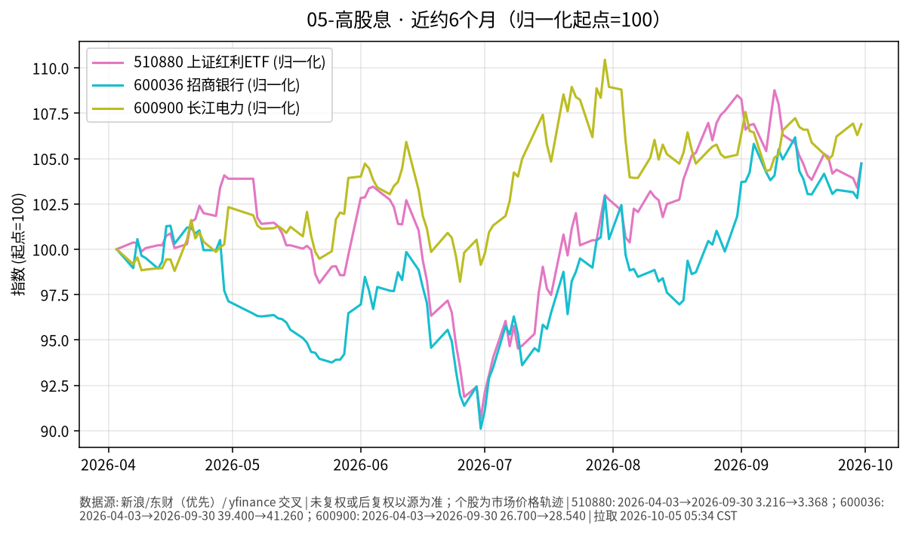

# 05-高股息日报 · 2026-10-05（周一）

> **市场日历**：国庆休市第 5 天，A 股上一交易日为 **2026-09-30**；预计 **10-08** 恢复（以交易所公告为准）。

## 市场状态

- A 股休市，510880 上证红利 ETF、招商银行、长江电力价格停在 9/30。节前最后一天高股息明显强于大盘（510880 +1.29%、招行 +1.85%，上证指数约 +0.31%）。
- 假期外盘：美股 10/2 在弱非农后上涨（标普开盘约 +0.9%，Reuters），美债长端收益率走高，美元本周上涨。
- 近 6 个月三条线都在上涨但路径分化：长电最强、招行与红利 ETF 接近。

## 关键数据

| 指标 | 数值 | 日变化 | 数据时点 / 来源 |
| --- | --- | --- | --- |
| 510880 上证红利 ETF | 3.368 | +1.29% | 2026-09-30，新浪日 K |
| 600036 招商银行 | 41.26 | +1.85% | 2026-09-30，新浪日 K |
| 600900 长江电力 | 28.54 | +0.56% | 2026-09-30，新浪日 K |
| 上证指数 | 3,842.20 | +0.31% | 2026-09-30，yfinance |

**近 6 个月（未复权市价）**：510880 约 3.216（2026-04-03）→ 3.368，约 **+4.7%**；招行 39.40 → 41.26，约 **+4.7%**；长电 26.70 → 28.54，约 **+6.9%**。未复权价格不含期间分红，实际含息回报会更高一些。

## 简要解读

1. 高股息板块半年涨幅个位数，但日内波动（如 9/30 单日 +1%~+2%）明显高于债券类，属于权益风险。
2. 节后开盘可能对假期外盘（美债利率、美元、全球股市）做集中反映，方向无法从休市期推断。
3. 高股息股的估值与国内长端利率相关：国内利率下行时股息率相对更有吸引力，反之亦然。

## 关注点与风险

- 10/8 开盘的跳空风险与节后资金回流节奏。
- 银行股看息差与资产质量信息；电力股看来水、电价政策。
- 价格图为未复权，跨越除息日时会看到价格下台阶。
- 本文仅陈述市场变化，不构成买卖或加仓建议。

## 来源与时间

- 新浪财经日 K：510880、600036、600900（拉取约 2026-10-05 05:34 CST）；yfinance：上证指数
- Reuters（经 WTBX 转载）：10/2 美股开盘表现
- 图：`charts/2026-10-05-6m.png`，新浪日 K 未复权收盘，2026-04-03 → 2026-09-30，归一化起点=100
