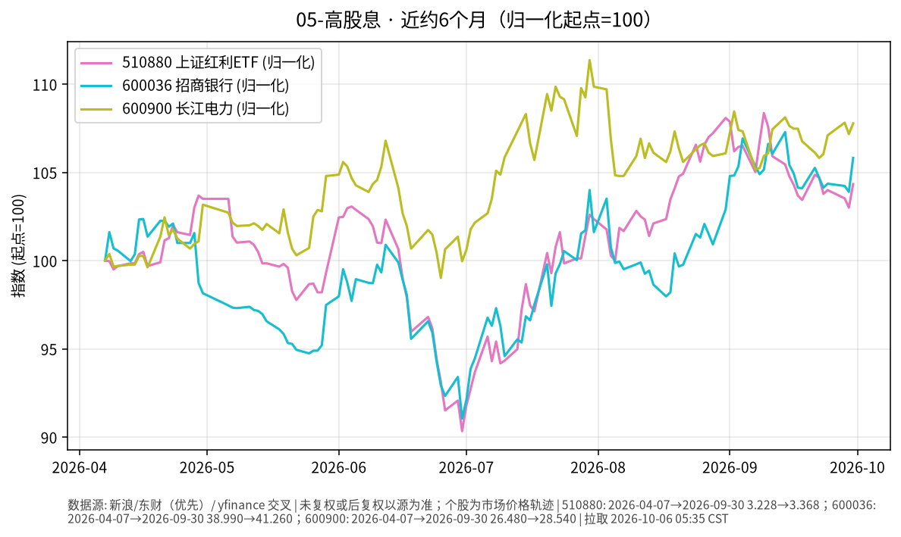

# 05-高股息日报 · 2026-10-06（周二）

> **市场日历**：国庆休市第 6 天，A 股停在 **2026-09-30**；预计 **10-08** 恢复（以交易所公告为准）。外盘最新为美东 **10/5（周一）**。

## 市场状态

- A 股休市，510880 上证红利 ETF、招商银行、长江电力价格停在 9/30。节前最后一天高股息明显强于大盘（510880 +1.29%、招行 +1.85%、长电 +0.56%，上证指数约 +0.31%）。
- 假期外盘：美股周一继续上涨，标普 500 收约 **7,774（+0.66%）**；但美 10Y 升到 5.31%、美元指数升到 102.12。在岸人民币（yfinance CNY=X）约 **6.696**，变化不大。
- 近 6 个月三条线都在上涨但路径分化：长电最强，招行次之，红利 ETF 稍弱。

## 关键数据

| 指标 | 数值 | 日变化 | 数据时点 / 来源 |
| --- | --- | --- | --- |
| 510880 上证红利 ETF | 3.368 | +1.29% | 2026-09-30，新浪日 K |
| 600036 招商银行 | 41.26 | +1.85% | 2026-09-30，新浪日 K |
| 600900 长江电力 | 28.54 | +0.56% | 2026-09-30，新浪日 K |
| 上证指数 | 3,842.20 | +0.31% | 2026-09-30，yfinance |
| 标普 500 | 约 7,773.95 | +0.66% | 美东 10/5，yfinance |

**近 6 个月（未复权市价）**：510880 约 3.228（2026-04-07）→ 3.368，约 **+4.3%**；招行 38.99 → 41.26，约 **+5.8%**；长电 26.48 → 28.54，约 **+7.8%**。未复权价格不含期间分红，实际含息回报会更高一些。

## 简要解读

1. 高股息板块半年涨幅个位数，但单日波动（如 9/30 单日 +1%~+2%，6 月底较 4 月初起点一度低约 9%）明显高于债券类，属于权益风险。
2. 节后开盘可能对假期外盘（美债利率、美元、全球股市）做集中反映，方向无法从休市期推断。
3. 高股息股的估值与国内长端利率相关：国内利率下行时股息率相对更有吸引力，反之亦然。

## 关注点与风险

- 10/8 节后首个交易日的成交与风格（高股息是否延续节前强势）。
- 招行三季报时间与分红政策；长电来水与电价相关信息。
- 个股集中度风险高于 ETF。
- 本文仅描述市场变化，不构成买卖或加仓建议。

## 来源与时间

- 新浪财经日 K：510880、600036、600900（拉取约 2026-10-06 05:35 CST）
- yfinance：000001.SS、^GSPC、CNY=X、DX-Y.NYB、^TNX
- 图：`charts/2026-10-06-6m.png`，新浪未复权收盘，2026-04-07 → 2026-09-30，归一化起点=100
