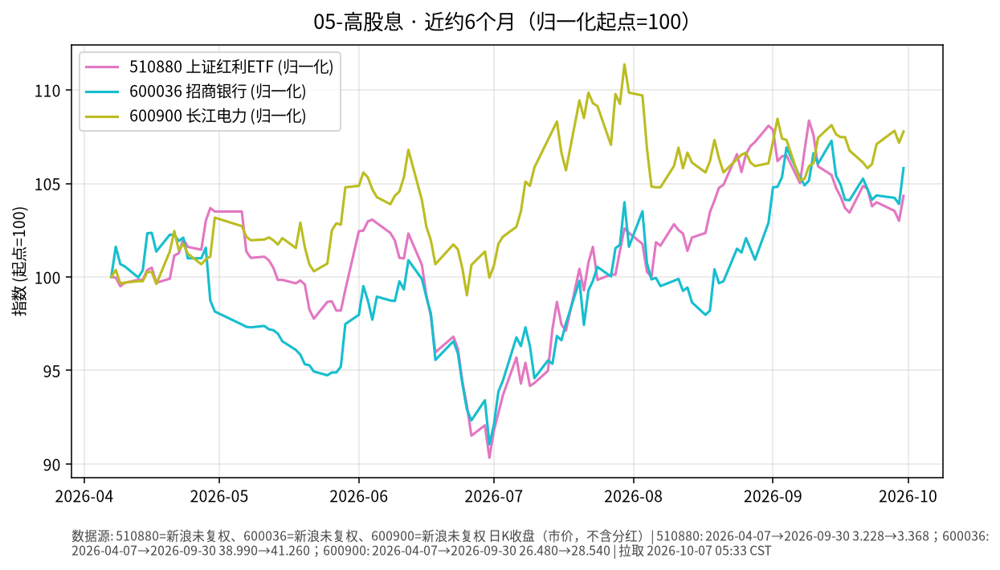

# 05-高股息日报 · 2026-10-07（周三）

> **市场日历**：国庆休市第 7 天（最后一天），A 股停在 **2026-09-30**；预计 **10-08** 恢复（以交易所公告为准）。外盘最新为美东 **10/6（周二）**；港股 10/6 正常交易。

## 市场状态

- A 股休市，510880 上证红利 ETF、招商银行、长江电力价格停在 9/30。节前最后一天高股息明显强于大盘（510880 +1.29%、招行 +1.85%、长电 +0.56%，上证指数约 +0.31%）。
- 假期外盘（10/1–10/6）：标普 500 四连涨，10/6 收 **7,818.93（+0.58%）**，为 8 月以来首个收盘新高；恒生指数 10/6 收 **24,280.56（+1.00%）**，但仍低于 9/30 的约 24,613（yfinance）。美 10Y 从 10/5 的 5.31% 回落到 5.27%，美元指数回落到约 101.86。
- 人民币：离岸 CNH 10/6 约 **6.7006**（yfinance），10/5 纽约尾盘 6.7037、较上周五升 21 点（每经网）；在岸休市，yfinance CNY=X 显示约 6.692，仅作参考。

## 关键数据

| 指标 | 数值 | 日变化 | 数据时点 / 来源 |
| --- | --- | --- | --- |
| 510880 上证红利 ETF | 3.368 | +1.29% | 2026-09-30，新浪日 K |
| 600036 招商银行 | 41.26 | +1.85% | 2026-09-30，新浪日 K |
| 600900 长江电力 | 28.54 | +0.56% | 2026-09-30，新浪日 K |
| 上证指数 | 3,842.20 | +0.31% | 2026-09-30，yfinance |
| 标普 500 | 7,818.93 | +0.58% | 美东 10/6，yfinance / Dow Jones |
| 恒生指数 | 24,280.56 | +1.00% | 2026-10-06，智通财经 |
| 离岸人民币 CNH | 约 6.7006 | — | 10/6，yfinance（单点） |

**近 6 个月（未复权市价）**：510880 约 3.228（2026-04-07）→ 3.368，约 **+4.3%**；招行 38.99 → 41.26，约 **+5.8%**；长电 26.48 → 28.54，约 **+7.8%**。未复权价格不含期间分红，实际含息回报会更高一些。区间内 6 月底是共同低点（510880 约 2.916、招行约 35.50，较 4 月初起点分别约 −9.7%、−9.0%）。

## 简要解读

1. 高股息板块半年涨幅个位数，但区间回撤接近 10%、单日波动 1%–2% 并不少见，明显高于债券类，属于权益风险。
2. 节后开盘可能对假期外盘做集中反映，涉及几条机制：美债利率（影响全球股票折现率与股息率的相对吸引力）、美元与人民币汇率（影响外资配置成本）、港股与美股的风险偏好；这些因素在假期中有涨有跌，方向无法从休市期推断。
3. 高股息股的估值与国内长端利率相关：国内利率下行时股息率相对更有吸引力，反之亦然。

## 关注点与风险

- 10/8 节后首个交易日的成交与风格（高股息是否延续节前强势）。
- 北京时间 10/8 凌晨的美联储 9 月会议纪要与 10 年期美债拍卖结果，本文撰写时尚未公布。
- 招行三季报时间与分红政策；长电来水与电价相关信息。
- 个股集中度风险高于 ETF。
- 本文只描述价格与机制，不构成买卖或加仓建议。

## 来源与时间

- 新浪财经日 K：510880、600036、600900（拉取约 2026-10-07 05:33 CST）
- yfinance：000001.SS、^GSPC、^HSI、CNY=X、CNH=X、DX-Y.NYB、^TNX；Dow Jones（Morningstar 转载）/ WSJ：10/6 美股收盘；智通财经：10/6 港股收盘；每经网：CNH 10/5 纽约尾盘
- 图：`charts/2026-10-07-6m.png`，新浪未复权收盘（市价，不含分红），2026-04-07 → 2026-09-30，归一化起点=100
