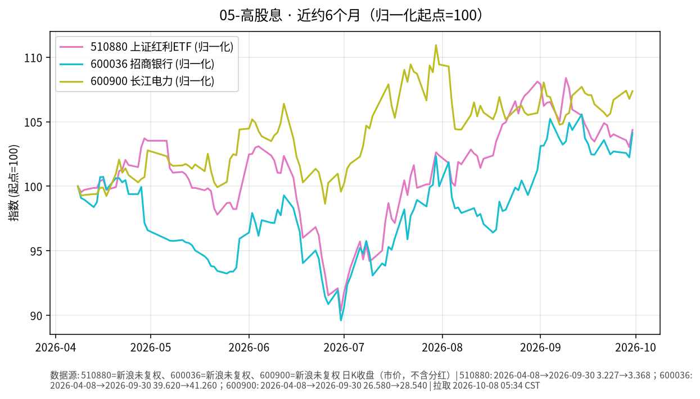

# 05-高股息日报 · 2026-10-08（周四）

> **市场日历**：今天是国庆节后首个交易日（上交所公告 10-01 至 10-07 休市、**10-08 起照常开市**）。撰写时约 05:35 CST，A 股尚未开盘，最新收盘仍是 **2026-09-30**。外盘最新为美东 **10/7（周三）**；港股 10/7 正常交易，今天港股通随 A 股复市恢复。

## 市场状态

- A 股：510880 上证红利 ETF、招商银行、长江电力价格停在 9/30。节前最后一天高股息明显强于大盘（510880 +1.29%、招行 +1.85%、长电 +0.56%，上证指数 +0.31%）。
- 假期外盘最后一天（10/7）：标普 500 收 **7,801.77（−0.22%）**，从前一日纪录高位回落；道指 **51,179.87（−0.66%）**。美 10Y 盘中触及约 5.36%（2002 年以来最高）后收在 5.276%；美联储纪要显示多数官员认为年底前可能再加息一次。
- 港股 10/7：恒生指数收 **24,130.50（−0.62%）**，主板成交 947 亿港元，为连续第三个交易日不足千亿（新华社 / 经济通）。蓝筹中汇丰 −1.9%、腾讯 −1.77%，中资银行股小幅波动（中行 −0.5%、建行 −0.21%、工行持平）。
- 人民币：离岸 CNH 10/6 纽约尾盘 **6.7015**，连续三日走强（TREE NEWS）；10/7 纽约尾盘官方口径本文未取到，yfinance CNH=X 单点约 6.7034 仅作参考。美元指数 10/7 回升至 **102.28**。

## 关键数据

| 指标 | 数值 | 日变化 | 数据时点 / 来源 |
| --- | --- | --- | --- |
| 510880 上证红利 ETF | 3.368 | +1.29% | 2026-09-30，新浪日 K |
| 600036 招商银行 | 41.26 | +1.85% | 2026-09-30，新浪日 K |
| 600900 长江电力 | 28.54 | +0.56% | 2026-09-30，新浪日 K |
| 上证指数 | 3,842.20 | +0.31% | 2026-09-30，yfinance |
| 标普 500 | 7,801.77 | −0.22% | 美东 10/7，yfinance |
| 恒生指数 | 24,130.50 | −0.62% | 2026-10-07 收盘（北京时间 16:00），新华社 |
| 离岸人民币 CNH | 6.7015 | 较前一尾盘升 22 点 | 10/6 纽约尾盘，TREE NEWS |
| 美元指数 | 102.28 | +0.44% | 美东 10/7，yfinance |

**国庆假期外盘累计（9/30 → 10/7）**：标普 500 7,651.54 → 7,801.77（约 **+2.0%**）；恒生指数 24,613.27 → 24,130.50（约 **−2.0%**）；美元指数 101.45 → 102.28（约 +0.8%）；美 10Y 基本持平（5.293% → 5.277%）。美股与港股假期方向相反。

**近 6 个月（未复权市价）**：510880 约 3.227（2026-04-08）→ 3.368，约 **+4.4%**；招行 39.62 → 41.26，约 **+4.1%**；长电 26.58 → 28.54，约 **+7.4%**。未复权价格不含期间分红，实际含息回报会更高一些。区间内 6 月底是共同低点（510880 6/30 约 2.916、招行 6/30 约 35.50，较 4 月 8 日起点分别约 −9.6%、−10.4%）；长电区间高点 7/30 约 29.49。

## 简要解读

1. 高股息板块半年涨幅个位数，但区间回撤约 10%、单日波动 1%–2% 并不少见，明显高于债券类，属于权益风险。
2. 今天 A 股开盘会对整个假期的外部变化做集中反映，而这些变化方向不一：美股假期累计上涨约 2%，港股累计下跌约 2%，美元走强、美债长端维持高位、人民币离岸价节内小幅走强。从休市期无法推断节后方向。
3. 高股息股的估值与利率相关：国内长端利率下行时股息率相对更有吸引力，反之亦然；海外利率处于高位时，外资对股息资产的比较基准也更高。

## 关注点与风险

- 10/8 节后首个交易日的成交量与风格（高股息是否延续节前强势、北向/南向资金恢复后的流向）。
- 美国 30 年期拍卖（北京时间 10/9 01:00）、美国 9 月 CPI（北京时间 10/14 20:30）对全球利率的影响。
- 招行三季报时间与分红政策；长电来水与电价相关信息。
- 个股集中度风险高于 ETF。
- 本文只描述价格与机制，不构成买卖或加仓建议。

## 来源与时间

- 新浪财经日 K：510880、600036、600900（拉取 2026-10-08 05:34 CST）
- yfinance：000001.SS、^GSPC、^DJI、^HSI、CNH=X、DX-Y.NYB、^TNX；新华社（中国金融信息网）、智通财经、经济通：10/7 港股收盘；TREE NEWS：CNH 10/6 纽约尾盘；Invezz / Dow Jones：10/7 美股与美债；上证公告〔2026〕22 号：休市安排
- 图：`charts/2026-10-08-6m.png`，新浪未复权收盘（市价，不含分红），2026-04-08 → 2026-09-30，归一化起点=100
