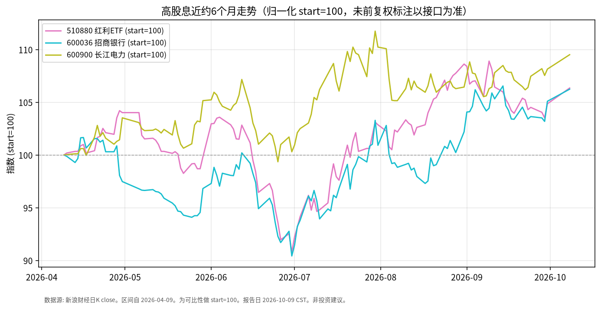

# 高股息日报 · 2026-10-09

> 日历说明：报告日 **2026-10-09 清晨 CST**；最新收盘 **2026-10-08**（国庆后首个交易日）。当日 A 股宽基多数下跌，**红利/银行/电力等风格相对强势**。

## 1. 市场状态

- 10/8 上证指数收报 **3811.90**，约 **-0.79%**；深成指约 **-2.07%**；创业板指约 **-3.15%**；科创50约 **-4.82%**。两市成交约 **1.69 万亿元**，较节前放量。
- 风格：公开报道称石油石化、电力、银行、航运等高股息/红利板块逆势或相对抗跌；科技成长回调。
- 样本标的：红利 ETF **510880**、招商银行 **600036**、长江电力 **600900** 10/8 均上涨约 **1.1%～1.4%**。

## 2. 关键数据

| 标的 | 最新交易日 | 收盘 | 相对9/30 | 近约1个月 | 近约6个月（自2026-04-09） |
|------|------------|------|----------|-----------|---------------------------|
| **510880** 华泰柏瑞红利ETF | 2026-10-08 | **3.416** | **+1.425%** | 约 -0.35% | 约 **+6.35%** |
| **600036** 招商银行 | 2026-10-08 | **41.71** | **+1.091%** | 约 +2.06% | 约 **+6.24%** |
| **600900** 长江电力 | 2026-10-08 | **28.90** | **+1.261%** | 约 +0.63% | 约 **+9.51%** |

图表为三标的 close 归一化 start=100（新浪日K；未额外手工前复权，长期比较请核对除权除息）。

## 3. 简要解读

- 节后首日市场整体回调，但高股息样本录得上涨，与“成长承压、红利相对占优”的公开盘面描述一致。
- 近 6 个月三标的价格累计升幅约 **6%～9.5%**，显著高于同期债券 ETF 的价格变动，也与黄金 ETF 回撤形成对照——仅陈述分化事实。
- 近 1 个月 510880 略回撤、银行与水电分化，说明高股息内部亦非同涨同跌。

## 4. 关注点与风险

- **风格切换可逆**：若风险偏好回升，红利相对优势可能阶段性减弱。
- **盈利与分红**：银行净息差、水电来水与电价政策等基本面因素会影响分红可持续性。
- **估值与拥挤度**：资金集中流入时波动与回撤风险上升。
- **口径**：价格收益 ≠ 含分红总回报；ETF 跟踪误差与费用需单独查看。

## 5. 来源与时间

- 个股/ETF：新浪财经日K —— **2026-10-09 约 06:30 CST**。
- 指数与风格：深蓝财经/金融界 10/8 收盘快讯；新浪财经 ETF 综述与红利板块报道（2026-10-08）。
- 休市安排：上交所 2026 年国庆休市安排。
- 声明：事实梳理，**非投资建议**。
